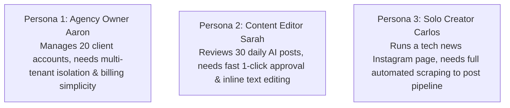
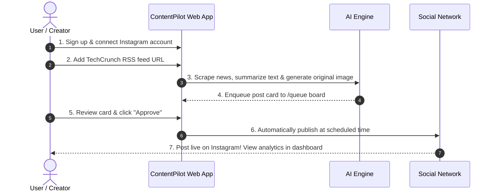

# ContentPilot AI - Product Requirements Document (PRD)

## Document Metadata

| Attribute | Value |
| :--- | :--- |
| **Document ID** | `DOC-01-PRD` |
| **Author** | Chief Product Officer & Principal Product Manager |
| **Status** | Approved / Production PRD Baseline |
| **Current Version** | `1.0.0` |
| **Last Updated** | `2026-07-31` |

### Version History
| Version | Date | Author | Description |
| :--- | :--- | :--- | :--- |
| `1.0.0` | 2026-07-31 | CPO & Product Lead | Initial commercial SaaS Product Requirements Document. |

### Document Assumptions
- Target users desire a hands-free or human-in-the-loop content creation workflow to publish daily news across social networks.
- Third-party social platform APIs (Meta/Instagram, X, LinkedIn) remain accessible for automated publishing.

### Document Limitations
- Real-time video creation (YouTube Shorts / TikTok) is scheduled for Version 3 product expansion.

### Future Improvements
- Automated AI brand tone auto-tuning based on historic engagement analytics feedback loops.

---

## 1. Executive Summary

**ContentPilot AI** is an autonomous, AI-driven multi-platform content publishing platform designed for digital publishers, media agencies, content creators, and enterprise marketing teams. The platform automates the end-to-end content pipeline: aggregating news from global feeds, performing AI factual summarization, converting news imagery into copyright-safe editorial artwork via Vision-to-Prompt models, applying workspace branding watermarks, orchestrating human-in-the-loop review queues, and publishing content automatically according to timezone-optimized schedules.

---

## 2. Problem Statement

Digital content creators and media publishers face three critical industry bottlenecks:

1. **High Operational Costs & Labor Exhaustion**: Crafting 5 to 10 daily social media posts per brand requires dedicated teams of researchers, copywriters, graphic designers, and social media managers costing over $12,000/month per channel.
2. **Copyright Infringement Risks**: Directly reposting source news photographs from press agencies leads to costly legal cease-and-desist claims and social account bans.
3. **Inconsistent Publishing & Slow Reaction Time**: Manual news curation delays post distribution by 4 to 8 hours, causing media brands to miss viral breaking news trends.

---

## 3. Vision & Mission

- **Vision**: To become the global infrastructure powering autonomous content synthesis and multi-platform publishing for digital media.
- **Mission**: Empower creators and agencies to publish high-quality, branded, copyright-safe news content 10x faster at a fraction of traditional operational costs.

---

## 4. Product Goals

1. **90% Time Reduction**: Reduce average post creation time from 45 minutes to under 2 minutes (including human review).
2. **100% Copyright Safety**: Eliminate direct image cloning by synthesizing original editorial art inspired by visual scene analysis.
3. **Multi-Channel Automation**: Enable single-click approval to publish across Instagram, X, LinkedIn, Facebook, Threads, and Telegram.
4. **SaaS Scalability**: Reach $100,000 MRR (Monthly Recurring Revenue) within 12 months post-launch.

---

## 5. Target Audience

1. **Digital News & Niche Publishers**: Tech, finance, gaming, science, space, and anime digital magazines needing high daily posting volume.
2. **Social Media Agencies**: Managing 10 to 50 client social accounts across multiple industries.
3. **Content Creators & Influencers**: Building personal brands around curated industry news.
4. **Enterprise Marketing Teams**: Maintaining corporate brand presence across global timezones.

---

## 6. User Personas



---

## 7. Market Analysis

The global Social Media Management Software market size is projected to reach **$41.8 Billion by 2030** (CAGR of 23.6%). The convergence of Generative AI (LLMs, Multimodal Vision, Image Synthesis) and automated publishing represents the fastest-growing sub-segment within digital marketing tech.

---

## 8. Competitor Analysis

| Competitor | Strengths | Major Weakness / Vulnerability | ContentPilot AI Advantage |
| :--- | :--- | :--- | :--- |
| **Hootsuite / Buffer** | Strong scheduling & multi-account scheduling | Zero AI news scraping or automatic image generation | Fully autonomous news ingestion to original AI creation pipeline |
| **Jasper / Copy.ai** | Strong text copywriting templates | No automated news ingestion, vision scene extraction, or publishing engine | End-to-end integration: Ingest → AI Synthesize → Approve → Publish |
| **Canva / Midjourney** | High image generation quality | Manual prompt input required; high risk of direct copyright reuse | 100% automated copyright-safe Vision-to-Image prompt engine |

---

## 9. Unique Value Proposition (UVP)

> *"ContentPilot AI turns global news feeds into fully branded, copyright-safe, social-ready posts and automatically publishes them to your channels in seconds."*

---

## 10. Business Model

ContentPilot AI operates as a **Subscription B2B/B2C SaaS** platform with tier-based pricing based on monthly social post volumes, connected social accounts, and workspace seat counts.

---

## 11. Pricing Strategy

| Feature / Tier | FREE TRIAL | PRO PLAN | ENTERPRISE PLAN |
| :--- | :---: | :---: | :---: |
| **Monthly Price** | $0 (14 Days) | **$49 / Month** | **$249 / Month** |
| **Connected Social Accounts** | 2 Accounts | 10 Accounts | 50 Accounts |
| **News Sources** | 3 Feeds | 25 Feeds | Unlimited Feeds |
| **AI Image Renders / Mo** | 20 Images | 1,000 Images | 10,000 Images |
| **Brand Logo Watermarking** | Yes | Yes | Custom Font & SVG Branding |
| **Team Workspace Seats** | 1 User | 3 Users | 15 Users (with RBAC) |
| **Support SLA** | Community | Priority Email | 24/7 Dedicated Account Manager |

---

## 12. Core Features (MVP - Version 1)

1. **Authentication & Multi-Tenant Workspaces**: User registration, JWT login, MFA, and workspace selection.
2. **News Source Aggregation**: RSS feed and Web Portal scraper configuration across 11 standard content categories.
3. **AI Factual Summarization**: LLM key takeaway extraction with low temperature ($T=0.2$) fact-checking guardrails.
4. **Copyright-Safe Vision-to-Image Synthesis**: 5-step visual scene breakdown transforming news photos into original FLUX/SDXL artwork.
5. **Brand Overlay Engine**: Automated workspace logo watermark rendering.
6. **Kanban Queue Board**: One-click approve/reject/edit interface for human-in-the-loop review.
7. **Instagram Graph API Publishing**: Automated single-image and carousel posting to Instagram business accounts.

---

## 13. Future Features Roadmap (V2 & V3)

### Version 2 (Expansion Phase)
- Platform Adapters for X (Twitter), LinkedIn, Facebook, Threads, and Telegram.
- Dynamic Timezone-Aware Posting Scheduler with category balancing.
- Automated Performance Analytics Dashboard (Impressions, Reach, Engagement).
- Custom Brand Template Builder (SVG borders, custom typography fonts).

### Version 3 (Enterprise & AI Phase)
- AI Video Generation for YouTube Shorts & TikTok MP4 reels.
- Self-Hosted Local GPU Model Engine (Ollama, Local FLUX.1 TensorRT) to reduce cloud API unit costs.
- Public SaaS Developer REST API & Webhooks.

---

## 14. Functional Scope

```mermaid
graph LR
    subgraph IN SCOPE (MVP & V2)
        RSS[RSS & Web News Ingestion]
        LLM[LLM Summaries & Captions]
        Vision[Vision Scene Extraction]
        Diff[FLUX/SDXL Editorial Art]
        Queue[Queue Review Board]
        Pub[Instagram, X, LinkedIn, FB]
    end

    subgraph OUT OF SCOPE (NON-GOALS)
        DirectCopy[Direct Source Image Reposting]
        ManualGraphic[Manual Graphic Photoshop Design]
        LegacyPrint[Print Newspaper Layouts]
    end
```

---

## 15. Out of Scope (Non-Goals)

- **Direct Image Reposting**: The system will never re-host raw copyrighted source photos without AI prompt transformation.
- **Manual Graphic Design Suite**: ContentPilot AI is an automated synthesis engine, not a manual canvas design tool (like Figma or Photoshop).

---

## 16. Key Performance Indicators (KPIs)

- **Monthly Recurring Revenue (MRR)**: Target $50,000 within 6 months.
- **Post Approval Rate**: $\ge 85\%$ of AI-generated queue items approved by users without manual text edits.
- **Publishing Reliability**: $99.9\%$ successful post dispatch rate to social platform APIs.
- **Customer Churn Rate**: $< 3.5\%$ monthly account cancellation rate.

---

## 17. User Journey Map



---

## 18. Core User Stories Matrix

| Story ID | Persona | Feature Requirement | Acceptance Criteria |
| :--- | :--- | :--- | :--- |
| `US-PRD-01` | Content Editor | News Source Ingestion | System parses RSS XML and ingests unique articles within 15 mins. |
| `US-PRD-02` | Brand Manager | Copyright-Safe Image | Generated image is an original render with workspace logo overlay. |
| `US-PRD-03` | Social Lead | One-Click Approval | Approving a post sets status to `SCHEDULED` and queues publication. |

---

## 19. Risks & Assumptions

| Risk Factor | Severity | Mitigation Strategy |
| :--- | :---: | :--- |
| **Social API Policy Changes** | High | Maintain modular `SocialPlatformAdapter` architecture and Playwright browser fallback. |
| **Upstream AI API Cost Spikes** | Medium | Implement Redis response caching and local open-weight model failovers (Ollama). |
| **Anti-Bot Scraper Blocks** | Medium | Utilize Playwright stealth browser contexts and official RSS feeds. |

---

## 20. Monetization Strategy

1. **Monthly Tier Subscriptions**: Recurring revenue from Pro ($49/mo) and Enterprise ($249/mo) plan subscriptions.
2. **Usage Add-Ons**: Additional AI image generation credits ($10 per 500 extra image renders).
3. **Enterprise Whitelabel Accounts**: Custom white-label branding portals for digital marketing agencies ($499/mo).

---

## 21. Marketing Strategy

- **Content Marketing & SEO**: Publish daily automated AI industry news breakdowns demonstrating platform capability.
- **Agency Affiliate Program**: Offer 20% recurring commission for social media agency referrals.
- **Product-Led Growth (PLG)**: 14-day free trial with 20 free AI posts to demonstrate immediate value.

---

## 22. Launch Strategy

1. **Beta Alpha (Weeks 1-4)**: Internal testing with 10 friendly media agencies.
2. **Product Hunt & Hacker News Launch (Week 6)**: Public launch featuring interactive live demo.
3. **Scale Marketing (Weeks 8-12)**: Targeted LinkedIn & Meta ad campaigns directed at agency directors.

---

## 23. High-Level Product Roadmap

```
Phase 1: MVP Core (Q3 2026) ──────► Phase 2: Multi-Platform (Q4 2026) ──────► Phase 3: Local AI & Video (Q1 2027)
• Instagram Publishing              • X, LinkedIn, FB, Telegram                • Local Ollama / FLUX Models
• RSS Scrapers                      • Timezone Scheduler                       • Shorts / TikTok Video Renders
• Vision Image Engine               • Analytics Dashboard                      • Developer SaaS API & Webhooks
```

---

## 24. Future Expansion Opportunities

- **Short-Form Video Generation**: Automated AI voiceover narration and background video synthesis for YouTube Shorts, Instagram Reels, and TikTok.
- **AI Newsletter Generator**: Automatically compiling top weekly approved social posts into an email newsletter (Substack / Mailchimp integration).

---

## 25. Appendix & Technical Document References

- Master System Blueprint: [00_MasterBlueprint.md](file:///d:/Projects/ContentPilot/docs/00_MasterBlueprint.md)
- Core System Architecture: [Architecture.md](file:///d:/Projects/ContentPilot/docs/Architecture.md)
- Complete Database Design: [Database.md](file:///d:/Projects/ContentPilot/docs/Database.md)
- REST API Specification: [API.md](file:///d:/Projects/ContentPilot/docs/API.md)
- Product Development Roadmap: [Roadmap.md](file:///d:/Projects/ContentPilot/docs/Roadmap.md)
- Functional Requirements: [16_FunctionalRequirements.md](file:///d:/Projects/ContentPilot/docs/16_FunctionalRequirements.md)
- AI Model Pipeline: [AI.md](file:///d:/Projects/ContentPilot/docs/AI.md)
- UI/UX & Design System: [UI_UX.md](file:///d:/Projects/ContentPilot/docs/UI_UX.md)
