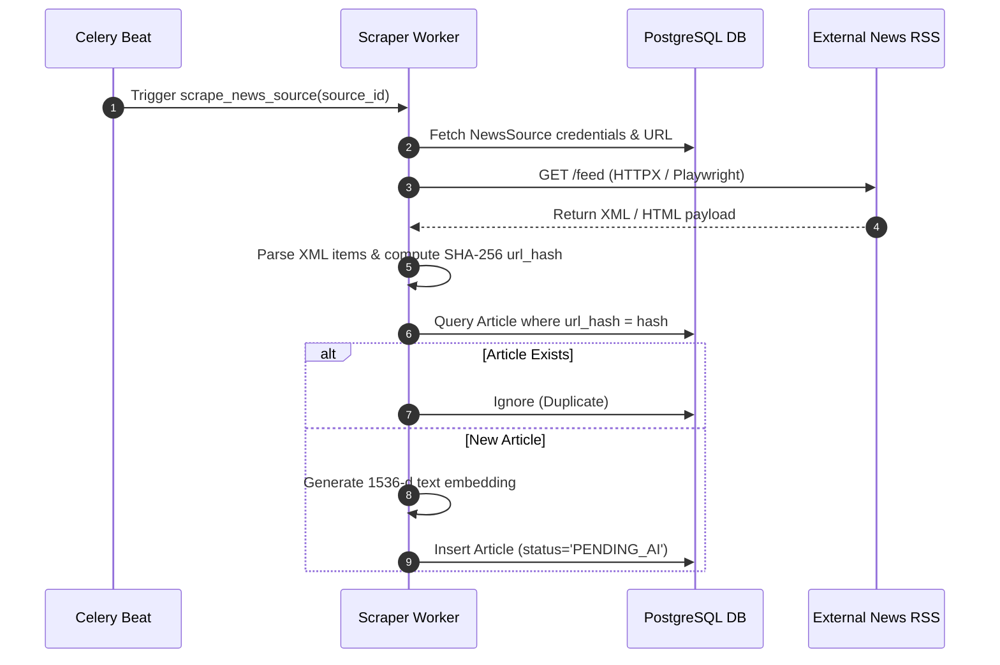
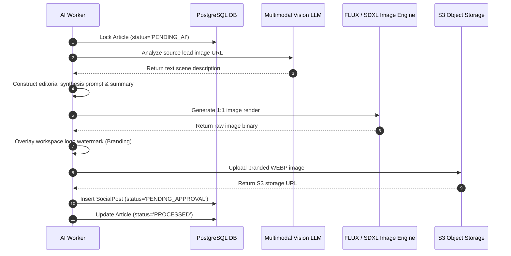

# ContentPilot AI - Functional Requirements Specification

## Document Metadata

| Attribute | Value |
| :--- | :--- |
| **Document ID** | `DOC-16-FUNCTIONAL-REQUIREMENTS` |
| **Author** | Principal Software Architect |
| **Status** | Approved / Enterprise Specification |
| **Current Version** | `1.0.0` |
| **Last Updated** | `2026-07-31` |

### Version History
| Version | Date | Author | Description |
| :--- | :--- | :--- | :--- |
| `1.0.0` | 2026-07-31 | Lead Architect | Initial functional requirements baseline specification. |

### Document Assumptions
- Workspace users have administrative authority to connect social network accounts.
- Social network APIs remain accessible via standard OAuth 2.0 protocol flows.

### Document Limitations
- Real-time video processing is specified for future Phase 3 development.

### Future Improvements
- Automated A/B variant testing for multi-caption queue approvals.

---

## 1. User Personas & User Stories

### Personas
1. **Workspace Owner (`OWNER`)**: Managing agency billing, social integrations, and workspace settings.
2. **Content Editor (`EDITOR`)**: Reviewing AI queue suggestions, tweaking captions/hashtags, and approving posts.
3. **Workspace Viewer (`VIEWER`)**: Monitoring analytics dashboards and performance reports.

### User Stories

#### **US-01: News Source Configuration**
> *As a Content Editor, I want to add RSS feeds and news portal URLs to my workspace so that the system automatically ingests relevant stories in real time.*

#### **US-02: Copyright-Safe AI Image Generation**
> *As a Brand Manager, I want the system to transform news lead photos into unique editorial artwork so that our social channels never publish copyrighted source imagery.*

#### **US-03: Timezone-Aware Scheduling**
> *As a Social Media Specialist, I want approved posts to be queued automatically into optimal posting slots so that content reaches followers at peak engagement hours.*

---

## 2. Core Business Rules (BR)

- **BR-01 (Deduplication Threshold)**: An ingested article is classified as a `DUPLICATE` if its SHA-256 URL hash matches an existing record or its `pgvector` cosine similarity exceeds 0.85 against articles ingested in the last 72 hours.
- **BR-02 (Channel Collision Protection)**: The publishing engine must maintain a minimum 120-minute gap between consecutive automated posts dispatched to the same social account.
- **BR-03 (Copyright Safety)**: Raw source images extracted from news sites must never be re-hosted or published directly without passing through the 5-step Vision Model prompt transformation and image synthesis engine.
- **BR-04 (Token Refresh Guardrail)**: Social OAuth refresh tokens expiring within 7 days must be automatically renewed by the background Celery token worker.

---

## 3. Complete System Use Cases

### UC-01: News Source Ingestion & Deduplication

#### **Actors**: Scraper Worker, Celery Beat, News Source Repository.
#### **Pre-conditions**: Active `NewsSource` record configured in workspace with `is_active = True`.

#### **Primary Flow**:
1. Celery Beat triggers `scrape_news_source` task every $N$ minutes.
2. Worker fetches feed XML via HTTPX (or launches Playwright if dynamic HTML portal).
3. Worker extracts article headline, body text, lead image URL, and computes SHA-256 `url_hash`.
4. Worker checks database; if hash is unique, computes OpenAI text embedding and saves `Article` record with `status = PENDING_AI`.

#### **Alternate Flow (Parsing Failure)**:
- If feed XML is malformed, log error payload to `SystemAuditLogs` and retry with exponential backoff up to 3 times before setting `NewsSource` status to `ERROR`.

#### **Edge Cases & Error Handling**:
- Feed returns HTTP 429 Rate Limit → Worker pauses requests for source domain for 15 minutes.

---

### UC-02: Vision-Driven AI Synthesis Pipeline

#### **Actors**: AI Worker Pool, OpenAI / Gemini API, S3 Storage.
#### **Pre-conditions**: `Article` record exists with status `PENDING_AI`.

---

### UC-03: Human Approval Queue & Post Review

#### **Actors**: Content Editor, Next.js Frontend, FastAPI Backend.
#### **Pre-conditions**: `SocialPost` record exists with `status = PENDING_APPROVAL`.

#### **Primary Flow**:
1. Editor views `/queue` board in frontend.
2. Editor reviews AI caption, hashtags, and generated image preview.
3. Editor optionally clicks "Edit", modifies text fields, and clicks **Approve**.
4. Frontend issues `POST /api/v1/posts/{id}/approve`.
5. Backend verifies workspace RBAC, updates post `status = APPROVED`, and assigns `scheduled_for` timestamp.

---

## 4. RBAC User Permission Matrix

| Operation / Endpoint | OWNER | ADMIN | EDITOR | VIEWER |
| :--- | :---: | :---: | :---: | :---: |
| `POST /workspaces` (Create Workspace) | Yes | No | No | No |
| `POST /social-accounts` (Connect Accounts) | Yes | Yes | No | No |
| `POST /news-sources` (Add Feed) | Yes | Yes | Yes | No |
| `POST /posts/{id}/approve` (Approve Post) | Yes | Yes | Yes | No |
| `GET /analytics/overview` (View Metrics) | Yes | Yes | Yes | Yes |

---

## 5. System Field Validation Rules

- **User Email**: Valid RFC 5322 email string, max 255 chars.
- **Article URL Hash**: 64-character lowercase hex string (SHA-256).
- **Post Caption**: String between 10 and 2200 characters (Instagram API upper bound).
- **Hashtags Array**: Array of 1 to 30 strings, each matching regex `^#[A-Za-z0-9_]+$`.

---

## Document Cross-References
- Global System Blueprint: [00_MasterBlueprint.md](file:///d:/Projects/ContentPilot/docs/00_MasterBlueprint.md)
- Core Feature Catalog: [Features.md](file:///d:/Projects/ContentPilot/docs/Features.md)
- REST API Schemas: [API.md](file:///d:/Projects/ContentPilot/docs/API.md)
- DB Schema & RBAC: [Database.md](file:///d:/Projects/ContentPilot/docs/Database.md)
