# ContentPilot AI - Sequence Diagrams & State Machines

## Document Metadata

| Attribute | Value |
| :--- | :--- |
| **Document ID** | `DOC-17-SEQUENCE-STATE-DIAGRAMS` |
| **Author** | Principal Software Architect |
| **Status** | Approved / Enterprise Specification |
| **Current Version** | `1.0.0` |
| **Last Updated** | `2026-07-31` |

### Version History
| Version | Date | Author | Description |
| :--- | :--- | :--- | :--- |
| `1.0.0` | 2026-07-31 | Lead Architect | Comprehensive sequence diagrams and state machine specifications. |

---

## 1. System State Machine Diagrams

### 1.1 Article Lifecycle State Machine

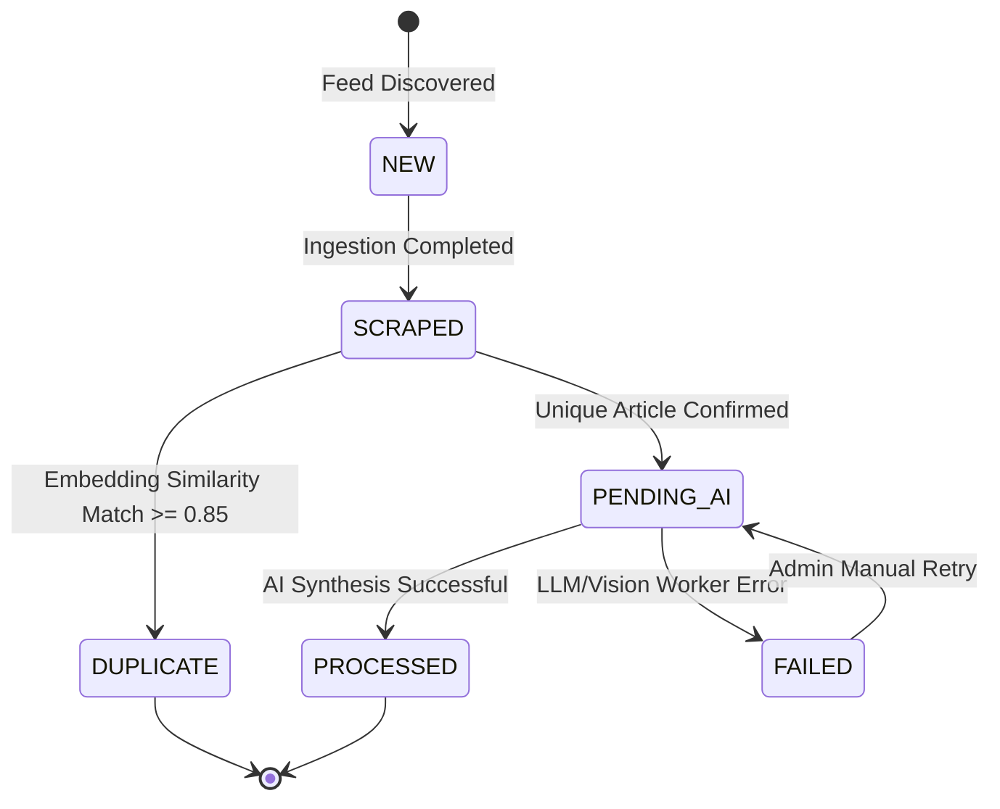

---

### 1.2 Social Post Lifecycle State Machine

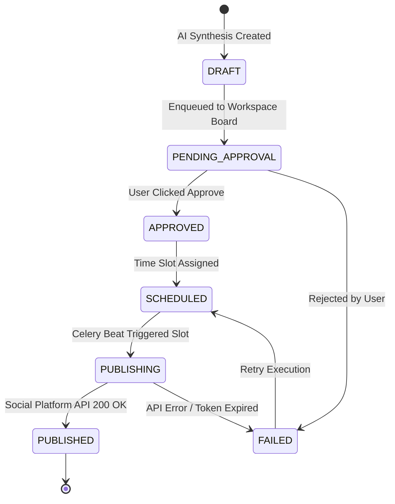

---

### 1.3 Social Account Lifecycle State Machine

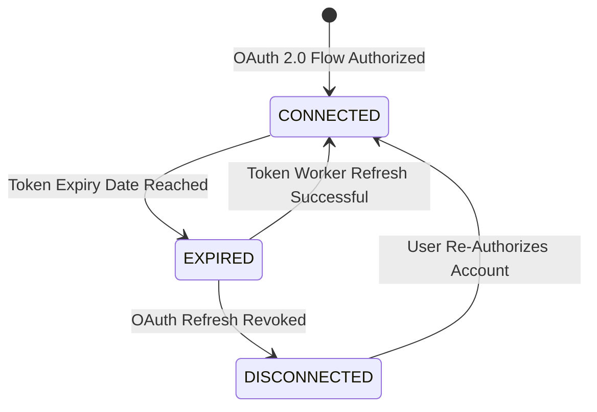

---

### 1.4 Worker Job State Machine

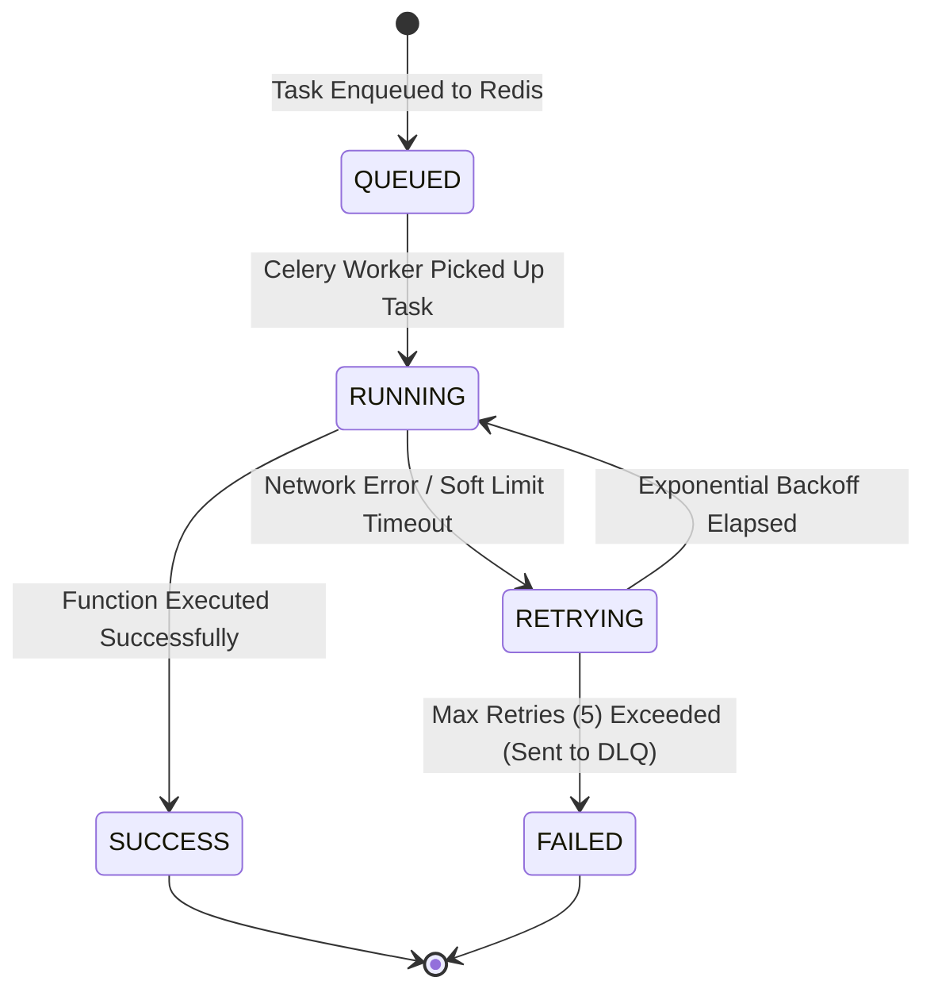

---

## 2. Core Sequence Diagrams

### 2.1 User Registration Flow

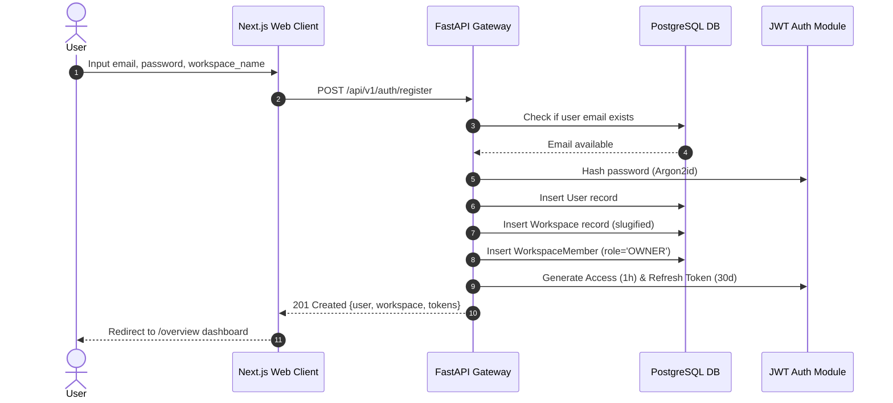

---

### 2.2 User Login & Token Renewal Flow

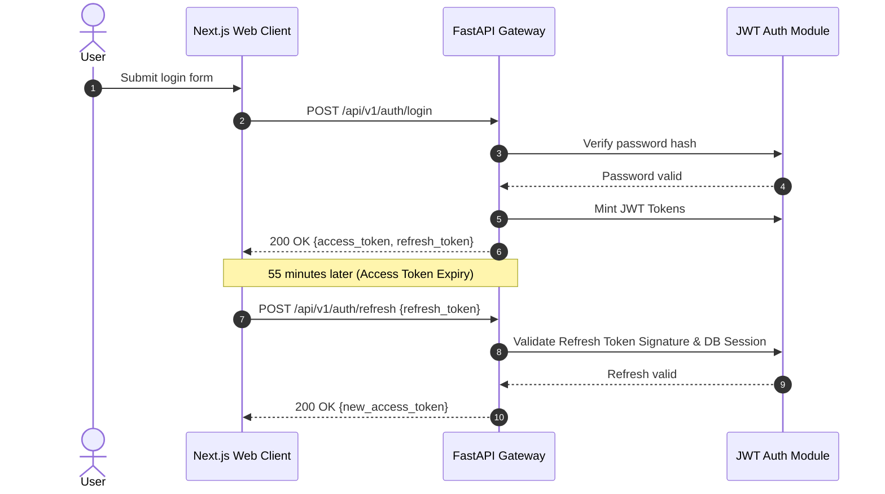

---

### 2.3 News Scraping Sequence

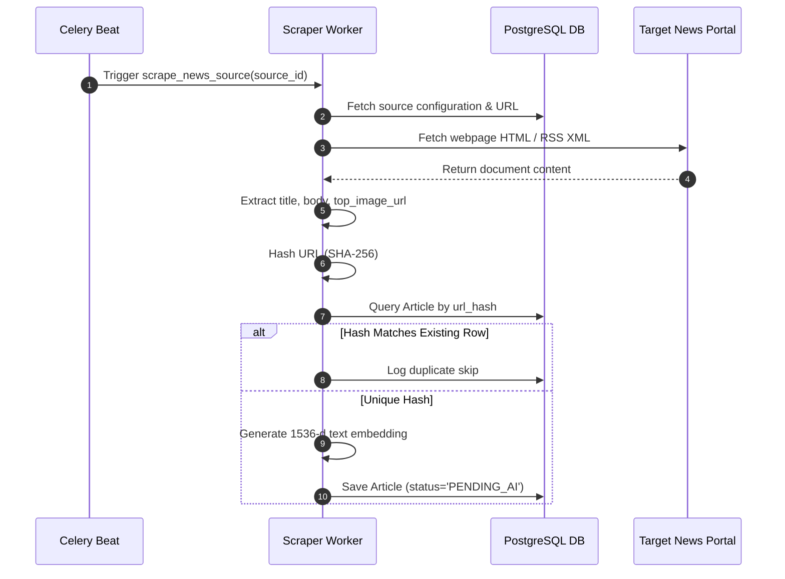

---

### 2.4 AI Processing Pipeline Sequence

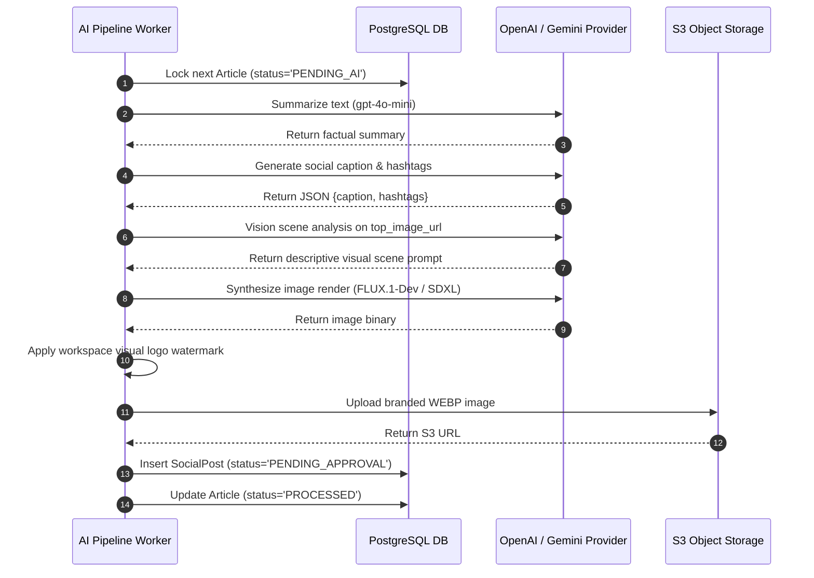

---

### 2.5 Image Generation & Branding Overlay Sequence

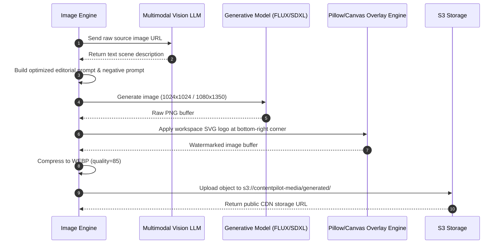

---

### 2.6 Queue Approval Sequence

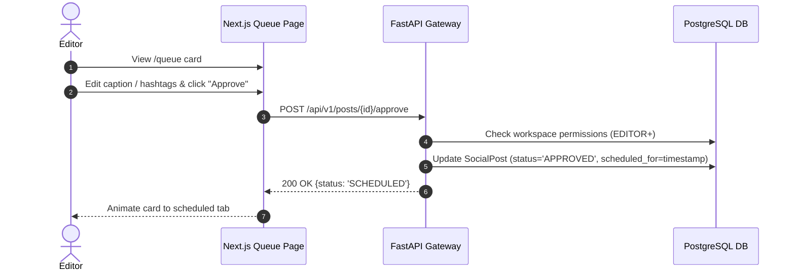

---

### 2.7 Scheduler Sequence

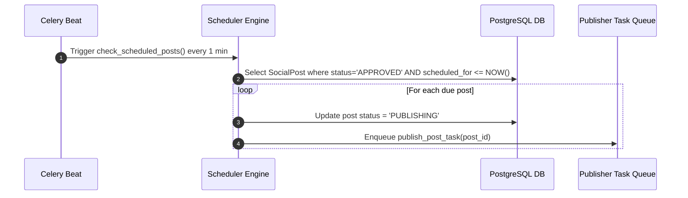

---

### 2.8 Publishing Engine Sequence

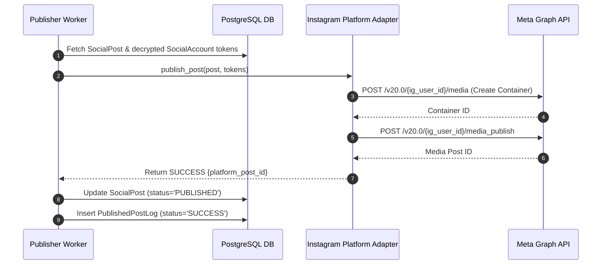

---

### 2.9 Analytics Collection Sequence

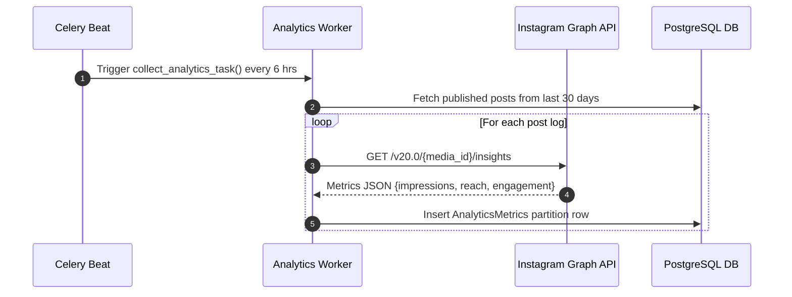

---

### 2.10 Multi-Channel Notification Flow Sequence

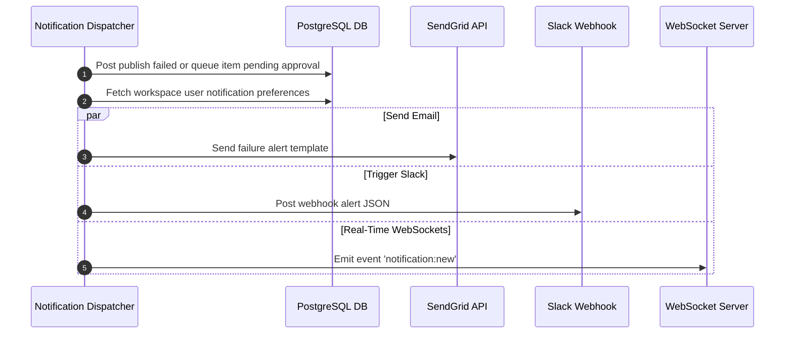

---

## Document Cross-References
- Global System Blueprint: [00_MasterBlueprint.md](file:///d:/Projects/ContentPilot/docs/00_MasterBlueprint.md)
- Core System Architecture: [Architecture.md](file:///d:/Projects/ContentPilot/docs/Architecture.md)
- Database Design & ERD: [Database.md](file:///d:/Projects/ContentPilot/docs/Database.md)
- REST API Specification: [API.md](file:///d:/Projects/ContentPilot/docs/API.md)
