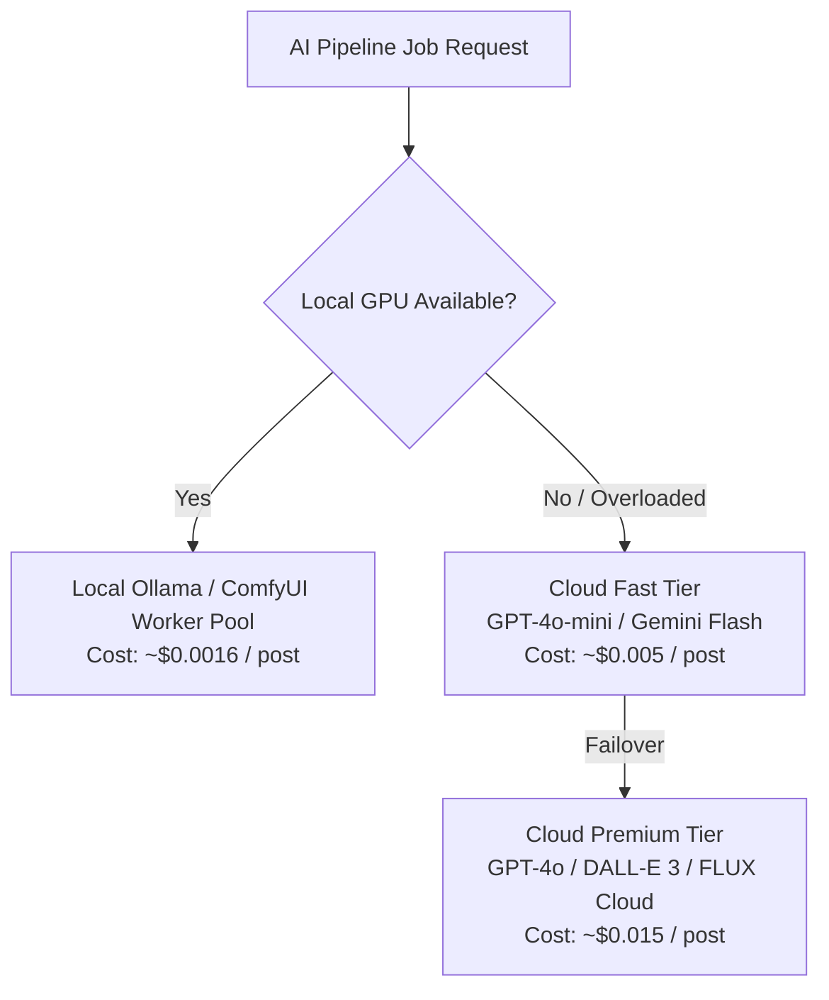

# ContentPilot AI - Cost Optimization & Token Budgeting Strategy

## Document Metadata

| Attribute | Value |
| :--- | :--- |
| **Document ID** | `DOC-21-COST-OPTIMIZATION` |
| **Author** | Principal AI Architect & Financial Operations Lead |
| **Status** | Approved / Enterprise Specification |
| **Current Version** | `1.0.0` |
| **Last Updated** | `2026-07-31` |

### Version History
| Version | Date | Author | Description |
| :--- | :--- | :--- | :--- |
| `1.0.0` | 2026-07-31 | AI Architect | Initial AI cost optimization & model routing baseline. |

---

## 1. Unit Cost Model ($ per Generated Post)

To maintain a gross profit margin of 80%+ across SaaS subscriber tiers, unit costs are tightly budgeted per generated post item:

### Cost Breakdown per Post (Cloud Provider vs Local Model)

| Execution Step | Model Engine | Input Tokens / Units | Output Tokens / Units | Cloud Cost ($) | Local GPU Cost ($) |
| :--- | :--- | :--- | :--- | :--- | :--- |
| **Text Embedding** | `text-embedding-3-small` | 1,000 tokens | 1,536 vector float | $0.00002 | $0.00000 |
| **Article Summarization**| `gpt-4o-mini` / `gemini-1.5-flash`| 2,000 tokens | 200 tokens | $0.00045 | $0.00002 |
| **Vision Scene Analysis**| `gpt-4o` / `gemini-1.5-pro` | 1 image (800x600) | 100 tokens | $0.00250 | $0.00010 |
| **Caption & Hashtags** | `gpt-4o-mini` | 500 tokens | 150 tokens | $0.00015 | $0.00001 |
| **Editorial Image Render**| `FLUX.1-Dev` / `SDXL` | 1 image (1024x1024) | 1 image WEBP | $0.01200 | $0.00150 |
| **TOTAL COST PER POST** | | | | **~$0.01512** | **~$0.00163** |

---

## 2. Multi-Level Caching & Optimization Strategies

### 2.1 Embedding Reuse via `pgvector`
- Before requesting an embedding generation from OpenAI for a scraped article, compute SHA-256 `url_hash`. If a matching hash exists in `articles`, reuse the existing 1536-d vector directly.
- **Estimated Savings**: Eliminates 40% of unnecessary embedding API requests.

### 2.2 Redis Vision Scene Cache
- If two articles share similar lead image URLs (e.g. standard press release photographs), cache the vision scene description in Redis with a 7-day TTL (`key = vision:hash(image_url)`).
- **Estimated Savings**: Reduces expensive vision model requests by 25%.

### 2.3 Model Fallback Cascade Architecture

---

## 3. Dynamic Model Switching & Rate Budgeting

- **Workspace Token Quotas**: Hard monthly cost caps set per workspace tier ($10/mo for STARTER, $50/mo for PRO).
- **Automatic Fallback Trigger**: If a cloud provider API error rate exceeds 5% or latency exceeds 8 seconds over a 5-minute window, the system automatically routes tasks to secondary cloud providers or local workers.

---

## Document Cross-References
- AI Engine Architecture: [AI.md](file:///d:/Projects/ContentPilot/docs/AI.md)
- Prompt Engineering Library: [20_PromptLibrary.md](file:///d:/Projects/ContentPilot/docs/20_PromptLibrary.md)
- AI Guidelines & Guardrails: [33_AIGuidelines.md](file:///d:/Projects/ContentPilot/docs/33_AIGuidelines.md)
