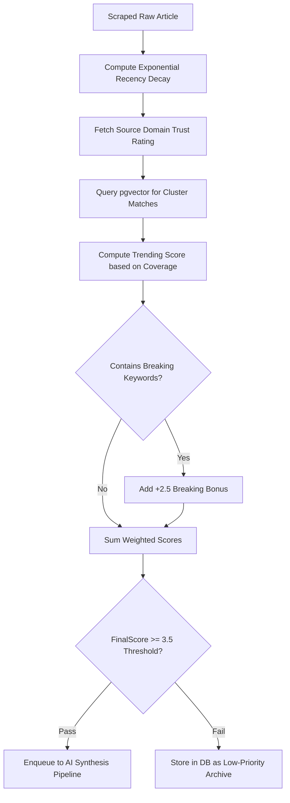

# ContentPilot AI - News Ranking & Trending Algorithm

## Document Metadata

| Attribute | Value |
| :--- | :--- |
| **Document ID** | `DOC-22-NEWS-RANKING-ALGORITHM` |
| **Author** | Principal Data Scientist & Software Architect |
| **Status** | Approved / Enterprise Specification |
| **Current Version** | `1.0.0` |
| **Last Updated** | `2026-07-31` |

### Version History
| Version | Date | Author | Description |
| :--- | :--- | :--- | :--- |
| `1.0.0` | 2026-07-31 | Data Science Lead | Initial article ranking & trending algorithm specification. |

---

## 1. Algorithm Overview & Scoring Formula

To ensure only high-impact, fresh, and relevant stories enter the AI synthesis pipeline, ContentPilot AI evaluates every ingested article using a multi-factor mathematical scoring model:

$$\text{FinalScore} = \left( w_{\text{rec}} \cdot S_{\text{rec}} \right) + \left( w_{\text{trust}} \cdot S_{\text{trust}} \right) + \left( w_{\text{pop}} \cdot S_{\text{pop}} \right) - \left( w_{\text{dup}} \cdot P_{\text{dup}} \right) + \left( w_{\text{trend}} \cdot S_{\text{trend}} \right) + S_{\text{breaking}}$$

---

## 2. Parameter & Component Definitions

### 2.1 Exponential Recency Decay ($S_{\text{rec}}$)
Freshness decays exponentially over time $\Delta t$ (hours elapsed since publication):

$$S_{\text{rec}} = \exp\left( -\frac{\Delta t}{\tau} \right), \quad \text{where } \tau = 6.0 \text{ hours}$$

- An article published **1 hour ago** receives a score of $S_{\text{rec}} \approx 0.84$.
- An article published **12 hours ago** receives a score of $S_{\text{rec}} \approx 0.13$.

### 2.2 Source Trust Score ($S_{\text{trust}}$)
Configured domain trust rating assigned to news feeds ($0.0 \text{ to } 1.0$).
- Tier 1 Outlets (Reuters, Bloomberg, TechCrunch): $S_{\text{trust}} = 1.0$
- Tier 2 Niche Blogs: $S_{\text{trust}} = 0.6$
- Unverified RSS Feeds: $S_{\text{trust}} = 0.3$

### 2.3 Duplicate Coverage Cluster Bonus ($P_{\text{dup}}$ & $S_{\text{trend}}$)
When multiple independent RSS feeds publish stories matching the same vector cluster (within cosine distance $< 0.15$), the system identifies the topic as **Trending**:

$$S_{\text{trend}} = \log_2(1 + N_{\text{cluster}})$$

Where $N_{\text{cluster}}$ is the count of distinct publications covering the story.

### 2.4 Breaking News Keyword Override ($S_{\text{breaking}}$)
If article headlines contain high-priority breaking news keywords (*"Breakthrough"*, *"Emergency"*, *"Unveiled"*, *"Acquisition"*), a flat bonus $S_{\text{breaking}} = +2.5$ is added.

---

## 3. Ranking Pipeline Flowchart

---

## 4. Default Parameter Weight Settings

| Weight Parameter | Value | Purpose |
| :--- | :---: | :--- |
| $w_{\text{rec}}$ | `3.0` | Heavily prioritizes recently published articles |
| $w_{\text{trust}}$ | `2.0` | Ensures high reputation sources are selected |
| $w_{\text{pop}}$ | `1.5` | Rewards stories with high social share indicators |
| $w_{\text{dup}}$ | `1.0` | Penalizes secondary reposts of identical content |
| $w_{\text{trend}}$ | `2.5` | Boosts stories covered by multiple news outlets |

---

## Document Cross-References
- Global System Blueprint: [00_MasterBlueprint.md](file:///d:/Projects/ContentPilot/docs/00_MasterBlueprint.md)
- AI Engine Architecture: [AI.md](file:///d:/Projects/ContentPilot/docs/AI.md)
- Database Design & pgvector: [Database.md](file:///d:/Projects/ContentPilot/docs/Database.md)
