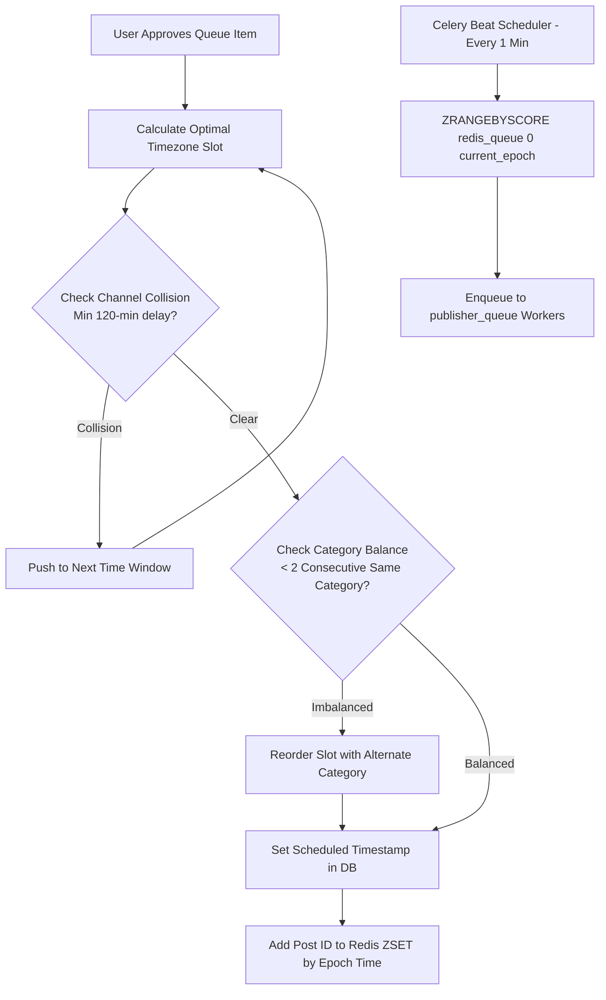

# ContentPilot AI - Timezone-Aware Automated Scheduler Specification

## Document Metadata

| Attribute | Value |
| :--- | :--- |
| **Document ID** | `DOC-24-SCHEDULER-ALGORITHM` |
| **Author** | Principal Software Architect |
| **Status** | Approved / Enterprise Specification |
| **Current Version** | `1.0.0` |
| **Last Updated** | `2026-07-31` |

### Version History
| Version | Date | Author | Description |
| :--- | :--- | :--- | :--- |
| `1.0.0` | 2026-07-31 | Lead Architect | Initial automated scheduler algorithm baseline. |

---

## 1. Scheduler Priority Queue Architecture

The scheduling engine uses a Redis-backed **ZSET Priority Queue** (Ordered Set) to organize approved posts by `scheduled_for` epoch timestamps.

---

## 2. Slot Selection & Timezone Normalization

### 2.1 Timezone Handling Standard
- All timestamps in PostgreSQL (`scheduled_for`, `published_at`) are stored strictly in **UTC (`TIMESTAMPTZ`)**.
- Workspace audience timezones (e.g., `America/New_York`, `Europe/London`, `Asia/Tokyo`) are configured in workspace settings and used to convert UTC dates into local peak engagement windows.

### 2.2 Peak Engagement Window Rules
Default peak posting slots configured per workspace:
1. **Morning Slot**: `09:00 AM` local timezone ($\pm 30 \text{ min jitter}$)
2. **Afternoon Slot**: `01:30 PM` local timezone ($\pm 30 \text{ min jitter}$)
3. **Evening Peak**: `07:00 PM` local timezone ($\pm 30 \text{ min jitter}$)

---

## 3. Collision Prevention & Category Balancing Rules

- **Channel Collision Guardrail**: No social account may publish more than 1 post within a 2-hour window ($120 \text{ minutes}$).
- **Category Balancing Guardrail**: The scheduler ensures that no single content category (e.g., *Technology*) occupies more than 2 consecutive posting slots on the same account. If a 3rd consecutive post of the same category is queued, it is automatically swapped with an approved post from a different category (*Business* or *Space*).
- **Max Posts Per Day**: Configurable per workspace (Default: 4 posts / account / day).

---

## Document Cross-References
- Global System Blueprint: [00_MasterBlueprint.md](file:///d:/Projects/ContentPilot/docs/00_MasterBlueprint.md)
- Task Automation & Celery: [Automation.md](file:///d:/Projects/ContentPilot/docs/Automation.md)
- REST API Schedules Endpoints: [API.md](file:///d:/Projects/ContentPilot/docs/API.md)
