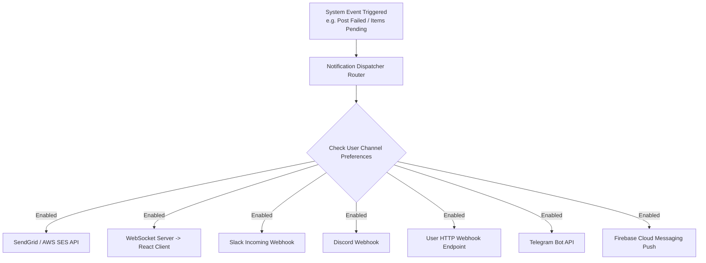

# ContentPilot AI - Multi-Channel Notification Engine Specification

## Document Metadata

| Attribute | Value |
| :--- | :--- |
| **Document ID** | `DOC-25-NOTIFICATIONS-ENGINE` |
| **Author** | Principal Software Architect |
| **Status** | Approved / Enterprise Specification |
| **Current Version** | `1.0.0` |
| **Last Updated** | `2026-07-31` |

### Version History
| Version | Date | Author | Description |
| :--- | :--- | :--- | :--- |
| `1.0.0` | 2026-07-31 | Lead Architect | Multi-channel notification engine baseline. |

---

## 1. Notification Architecture Overview

ContentPilot AI dispatches real-time operational events across 7 distinct communication channels via an asynchronous notification router task in Celery.



---

## 2. Event Trigger & Channel Routing Matrix

| System Event | Criticality | Default Channels | Description / Payload Summary |
| :--- | :--- | :--- | :--- |
| `POST_PENDING_APPROVAL` | Normal | In-App, Slack, Webhook | Alert editors that new AI posts are ready for review |
| `POST_PUBLISHED_SUCCESS`| Low | In-App, Webhook | Confirmation of successful post dispatch |
| `POST_PUBLISHING_FAILED` | High | Email, In-App, Slack, Telegram | Alert admins of publishing failure (e.g. API token error) |
| `OAUTH_TOKEN_EXPIRING` | High | Email, In-App | 7-day warning before social account disconnects |
| `QUOTA_EXCEEDED_80` | Warning | Email, In-App | Workspace consumed 80% of monthly image budget |

---

## 3. Webhook Delivery Payload & Retry Strategy

### 3.1 Custom Webhook JSON Payload Example

```json
{
  "event": "post.published",
  "workspace_id": "22222222-2222-2222-2222-222222222222",
  "timestamp": "2026-07-31T19:40:00Z",
  "data": {
    "post_id": "55555555-5555-5555-5555-555555555555",
    "platform": "INSTAGRAM",
    "post_url": "https://www.instagram.com/p/C-X8192aF/",
    "caption": "🚀 Massive step forward in AI hardware!..."
  }
}
```

### 3.2 Webhook Signature & Retry Policy
- **HMAC Signature**: All outgoing HTTP webhook requests include header `X-ContentPilot-Signature: sha256=...` signed with the workspace webhook secret.
- **Retry Policy**: Failed webhook endpoints (non-2xx response) are retried 5 times with exponential backoff (15s, 1m, 5m, 15m, 1h).

---

## Document Cross-References
- Global System Blueprint: [00_MasterBlueprint.md](file:///d:/Projects/ContentPilot/docs/00_MasterBlueprint.md)
- REST API Notifications: [API.md](file:///d:/Projects/ContentPilot/docs/API.md)
- Database Notifications Schema: [Database.md](file:///d:/Projects/ContentPilot/docs/Database.md)
