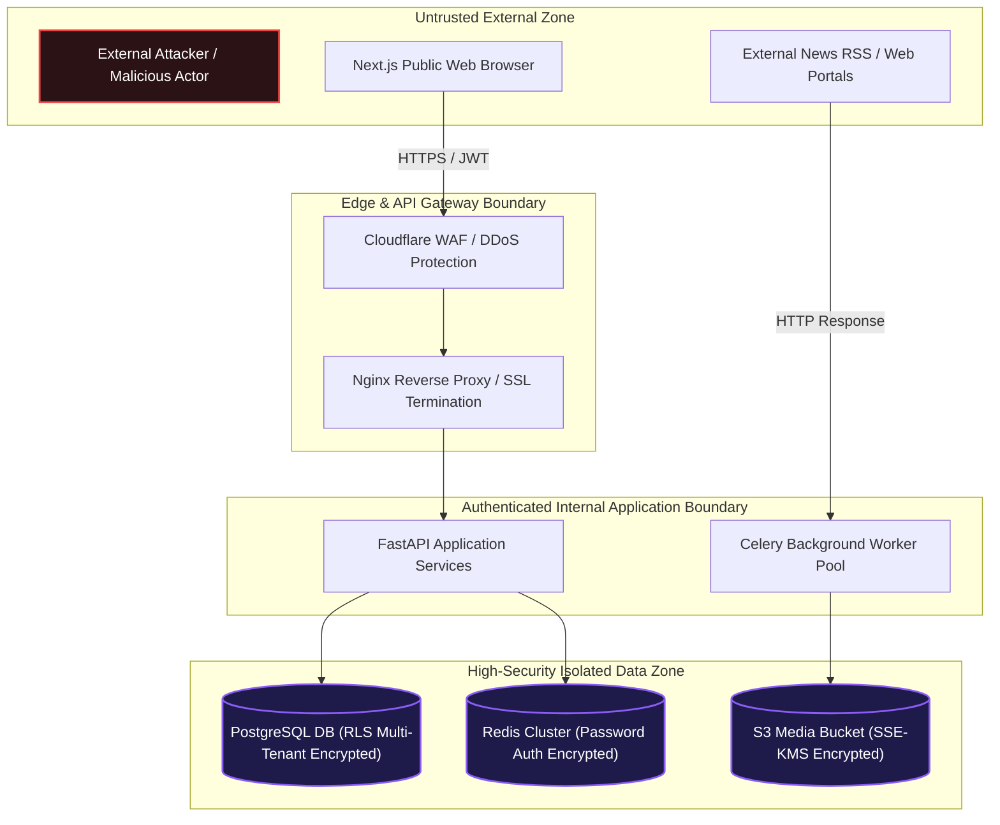

# ContentPilot AI - STRIDE Threat Model & Security Controls

## Document Metadata

| Attribute | Value |
| :--- | :--- |
| **Document ID** | `DOC-28-THREAT-MODEL` |
| **Author** | Principal Security Architect |
| **Status** | Approved / Enterprise Specification |
| **Current Version** | `1.0.0` |
| **Last Updated** | `2026-07-31` |

### Version History
| Version | Date | Author | Description |
| :--- | :--- | :--- | :--- |
| `1.0.0` | 2026-07-31 | Security Lead | STRIDE threat modeling & security control specification. |

---

## 1. System Trust Boundaries Diagram

---

## 2. STRIDE Threat Analysis Matrix

| Threat Category | Potential Attack Vector | Impact | Engineering Security Control |
| :--- | :--- | :--- | :--- |
| **Spoofing (Identity)** | Attacker steals JWT access token or attempts password brute-force | High | Argon2id password hashing, short-lived (1h) JWT access tokens, TOTP MFA support, IP-rate-limiting (`slowapi`). |
| **Tampering (Data)** | Attacker intercepts or tampers with outgoing social post payloads or webhooks | High | TLS 1.3 encryption in transit, HMAC-SHA256 signature verification on outgoing webhooks (`X-ContentPilot-Signature`). |
| **Repudiation** | User denies approving a post or altering workspace brand settings | Medium | Append-only `SystemAuditLogs` table recording user ID, IP address, timestamp, and action diff payload. |
| **Information Disclosure** | Leak of third-party social OAuth tokens (Instagram/X) | Critical | OAuth tokens encrypted at rest via AES-256-GCM in PostgreSQL; tokens omitted from API JSON responses. |
| **Denial of Service (DoS)** | Attacker floods scraper or AI generation endpoints to drain API budgets | High | Redis-backed sliding-window rate limiters per workspace tier; Celery worker concurrency limits and hard task time limits. |
| **Elevation of Privilege** | Member user attempts workspace administrative actions | High | Strict FastAPI Dependency Injection verifying workspace member RBAC role (`OWNER`, `ADMIN`, `EDITOR`, `VIEWER`). |

---

## 3. Vulnerability Mitigation Controls

1. **XML External Entity (XXE) Prevention**: RSS/Atom XML parser uses `defusedxml` to block entity resolution attacks.
2. **Server-Side Request Forgery (SSRF) Protection**: Scrapers and vision image fetchers validate destination IP ranges, blocking private subnet requests (`10.0.0.0/8`, `172.16.0.0/12`, `192.168.0.0/16`, `127.0.0.1`).
3. **Prompt Injection Defense**: LLM system prompts strictly isolate user article text inside delimiter blocks, and responses are validated against Pydantic schemas.

---

## Document Cross-References
- Global System Blueprint: [00_MasterBlueprint.md](file:///d:/Projects/ContentPilot/docs/00_MasterBlueprint.md)
- Legal & Compliance: [27_LegalCompliance.md](file:///d:/Projects/ContentPilot/docs/27_LegalCompliance.md)
- Database Audit Log Schema: [Database.md](file:///d:/Projects/ContentPilot/docs/Database.md)
