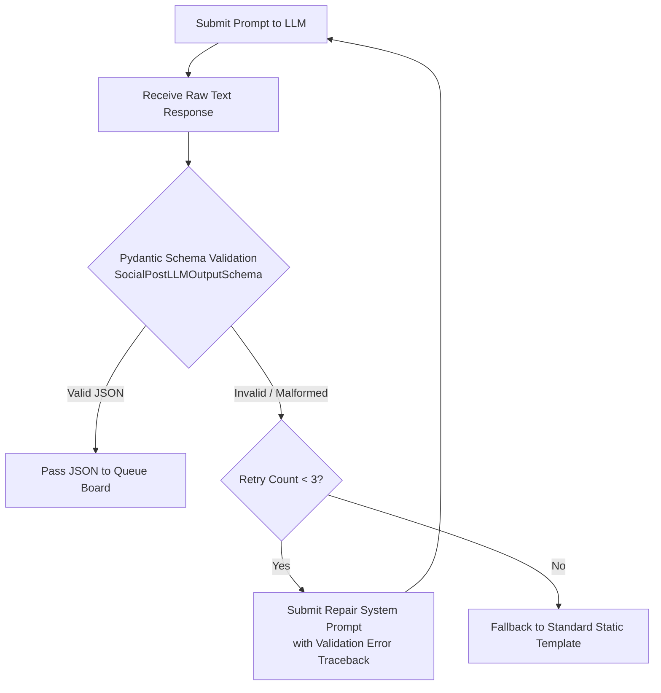

# ContentPilot AI - AI Safety, Governance & Engineering Guidelines

## Document Metadata

| Attribute | Value |
| :--- | :--- |
| **Document ID** | `DOC-33-AI-GUIDELINES` |
| **Author** | Principal AI Architect & Ethics Officer |
| **Status** | Approved / Enterprise Specification |
| **Current Version** | `1.0.0` |
| **Last Updated** | `2026-07-31` |

### Version History
| Version | Date | Author | Description |
| :--- | :--- | :--- | :--- |
| `1.0.0` | 2026-07-31 | AI Safety Lead | Baseline AI safety, hallucination control, and prompt governance rules. |

---

## 1. Hallucination Control & Fact-Checking Guardrails

To prevent LLMs from hallucinating unverified statistics, fake quotes, or misleading news claims:

1. **Grounded Source Scoping**: Summarization and caption prompts mandate that the model utilize *only* explicitly provided source article body text. The system prompt instructs: *"If a fact or statistic is not present in the provided text, do not invent or extrapolate it."*
2. **Temperature Settings**:
   - **Summarization & Fact Extraction**: Fixed at low temperature $T = 0.2$ to enforce deterministic factual accuracy.
   - **Creative Social Captions**: Fixed at moderate temperature $T = 0.6$ for engaging copy while retaining factual grounding.
3. **Fact-Check Pass Filter**: High-risk categories (*Politics, Finance, Health*) pass through an automated secondary validation LLM prompt verifying that generated captions do not contradict the original article text.

---

## 2. Output Validation & JSON Repair Strategy

---

## 3. Prompt Versioning & Governance Policy

- **Semantic Prompt Versioning**: Prompts follow `v<Major>.<Minor>.<Patch>` notation (e.g. `v1.2.0-caption`).
- **Prompt Regression Testing**: Before deploying a prompt version change to production, run automated evaluation benchmark against 100 gold-standard article summaries, verifying zero JSON schema parse errors and zero hallucinated entities.

---

## Document Cross-References
- Production Prompt Library: [20_PromptLibrary.md](file:///d:/Projects/ContentPilot/docs/20_PromptLibrary.md)
- AI Cost Optimization: [21_CostOptimization.md](file:///d:/Projects/ContentPilot/docs/21_CostOptimization.md)
- AI Engine Architecture: [AI.md](file:///d:/Projects/ContentPilot/docs/AI.md)
