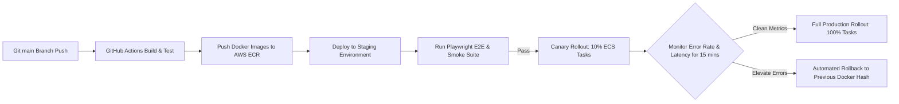

# ContentPilot AI - Release Management, Versioning & Rollback Strategy

## Document Metadata

| Attribute | Value |
| :--- | :--- |
| **Document ID** | `DOC-34-RELEASE-MANAGEMENT` |
| **Author** | Principal Release Engineer & Software Architect |
| **Status** | Approved / Enterprise Specification |
| **Current Version** | `1.0.0` |
| **Last Updated** | `2026-07-31` |

### Version History
| Version | Date | Author | Description |
| :--- | :--- | :--- | :--- |
| `1.0.0` | 2026-07-31 | Release Lead | Release lifecycle, canary deployment, and rollback runbook specification. |

---

## 1. Semantic Versioning (SemVer 2.0.0) Standard

ContentPilot AI adheres to **Semantic Versioning** (`MAJOR.MINOR.PATCH`):

- **MAJOR**: Breaking API structural changes, database schema breaking migrations, or major architectural refactors (e.g. `v2.0.0`).
- **MINOR**: Backward-compatible new features, platform adapters, or new API endpoints (e.g. `v1.3.0`).
- **PATCH**: Backward-compatible bug fixes, security patches, or prompt tuning (e.g. `v1.2.4`).

---

## 2. Release Execution Pipeline & Canary Strategy

---

## 3. Automated Rollback Runbook (< 3 Minutes)

If the 500 error rate exceeds **1.0%** or p95 API latency exceeds **500ms** during canary deployment:

1. **Automated Trigger**: CloudWatch Alarm fires `RollbackECSDeploymentEvent`.
2. **ECS Task Reversion**: AWS ECS automatically switches target group routing back to the previous stable Docker image tag (`contentpilot-backend:v1.1.9`).
3. **Database Migration Safety**: All database schema migrations executed via Alembic must be backward-compatible (expanding schema before dropping columns) to prevent breaking running backend tasks during rollback.

---

## Document Cross-References
- Global System Blueprint: [00_MasterBlueprint.md](file:///d:/Projects/ContentPilot/docs/00_MasterBlueprint.md)
- Infrastructure Deployment: [Deployment.md](file:///d:/Projects/ContentPilot/docs/Deployment.md)
- Configuration & Feature Flags: [18_Configuration.md](file:///d:/Projects/ContentPilot/docs/18_Configuration.md)
