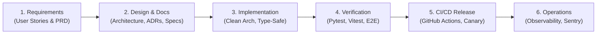

# ContentPilot AI - End-to-End Engineering SDLC & Workflow Guide

## Document Metadata

| Attribute | Value |
| :--- | :--- |
| **Document ID** | `DOC-35-DEVELOPMENT-WORKFLOW` |
| **Author** | Principal Software Architect & VP of Engineering |
| **Status** | Approved / Enterprise Specification |
| **Current Version** | `1.0.0` |
| **Last Updated** | `2026-07-31` |

### Version History
| Version | Date | Author | Description |
| :--- | :--- | :--- | :--- |
| `1.0.0` | 2026-07-31 | Engineering Lead | End-to-end SDLC & engineering onboarding workflow baseline. |

---

## 1. End-to-End Software Development Lifecycle (SDLC)

ContentPilot AI enforces a strict 6-phase engineering lifecycle:



---

## 2. Git Branching Strategy (Gitflow Standard)

- **`main`**: Production-ready code. Protected branch requiring 2 reviewer approvals and passing CI checks.
- **`develop`**: Staging integration branch.
- **`feature/<feature-name>`**: Short-lived feature branches created off `develop`.
- **`hotfix/<issue-name>`**: Urgent production fixes created off `main`.

---

## 3. Local Developer Setup & Onboarding Guide

### Step 1: Clone & Configure Environment
```bash
git clone https://github.com/contentpilot/contentpilot-ai.git
cd contentpilot-ai
cp backend/.env.example backend/.env
cp frontend/.env.example frontend/.env
```

### Step 2: Spin Up Infrastructure Containers
```bash
docker-compose up -d postgres redis
```

### Step 3: Run Database Migrations & Initial Seed Data
```bash
cd backend
python -m venv venv
source venv/bin/activate  # On Windows: venv\Scripts\activate
pip install -r requirements.txt
alembic upgrade head
python scripts/seed_demo_data.py
```

### Step 4: Run Backend & Frontend Servers
```bash
# Terminal 1 - FastAPI API Server
uvicorn app.main:app --reload --port 8000

# Terminal 2 - Celery Worker Pool
celery -A app.workers.celery_app worker -l info

# Terminal 3 - Next.js Frontend
cd frontend && npm run dev
```

---

## 4. Code Review Checklist for Engineers

Before submitting a PR for review:
- [ ] Code follows [CodingStandards.md](file:///d:/Projects/ContentPilot/docs/CodingStandards.md) (PEP 8, strict TypeScript, no `any`).
- [ ] Pytest and Vitest coverage on modified files is $\ge 85\%$.
- [ ] New database schema modifications include an Alembic migration script.
- [ ] Architecture Decision Records (ADRs) created for any major technical library or framework additions.
- [ ] Documentation updated in `docs/` reflecting API or feature changes.

---

## Document Cross-References
- Master Blueprint: [00_MasterBlueprint.md](file:///d:/Projects/ContentPilot/docs/00_MasterBlueprint.md)
- Coding Standards: [CodingStandards.md](file:///d:/Projects/ContentPilot/docs/CodingStandards.md)
- Testing Matrix: [32_TestMatrix.md](file:///d:/Projects/ContentPilot/docs/32_TestMatrix.md)
- Release Strategy: [34_Releases.md](file:///d:/Projects/ContentPilot/docs/34_Releases.md)
