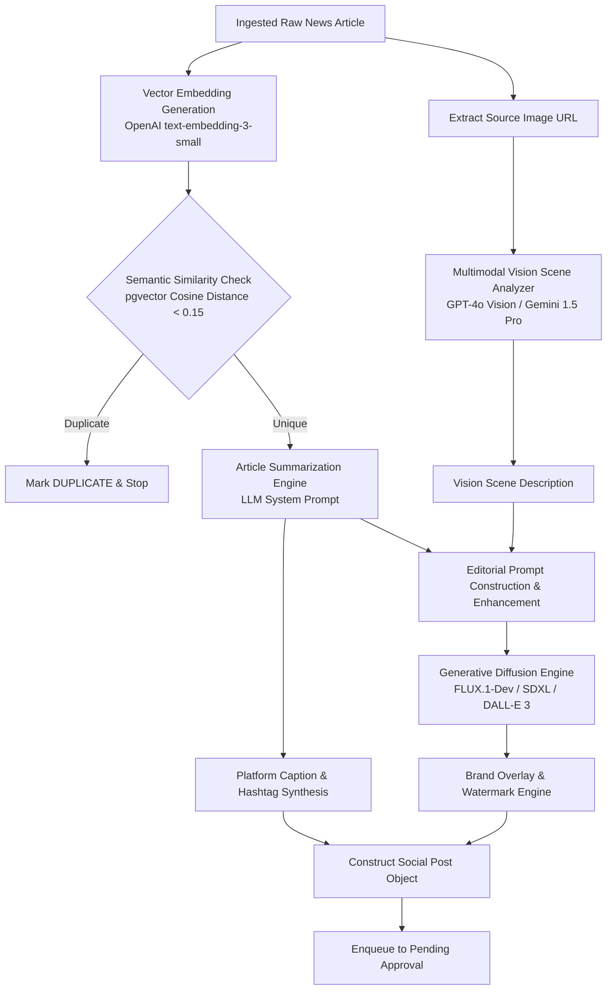
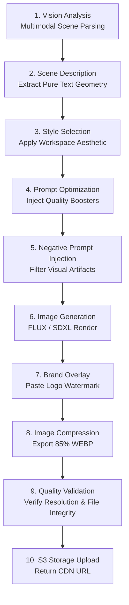

# ContentPilot AI - Artificial Intelligence Pipeline & Model Abstraction

## 1. System AI Architecture

ContentPilot AI features a decoupled, multi-provider AI synthesis pipeline designed to process news articles, extract visual context, synthesize social captions, and generate original, copyright-free editorial artwork.



---

## 2. Copyright-Safe Vision-to-Image Generation Engine

### 2.1 The Problem & Solution Workflow
Directly reposting news photographs collected from external publications causes copyright infringement. ContentPilot AI solves this through a **5-Step Vision Model Synthesis Workflow**:

1. **Image Ingestion**: Extract top image URL from source news article.
2. **Vision Analysis**: Pass image to Multimodal Vision LLM to produce a pure text description of the underlying scene, subject, lighting, and mood (discarding original image binary).
3. **Prompt Optimization**: Combine scene description with article summary context, adding professional editorial styling tokens (e.g., *"editorial illustration, 8k render, photorealistic, neon accents"*).
4. **Original Image Generation**: Pass prompt to FLUX or SDXL to render a brand-new image inspired by the news scene.
5. **Branding Overlay**: Apply workspace logo watermark and visual borders via PIL/Canvas engine.

---

## 3. Provider Abstraction Layer (PAL)

To maintain vendor independence and support local open-weight models (Ollama, Llama 3, Qwen 2, FLUX, SDXL), all AI interactions are routed through a abstract interface contract.

### 3.1 Interface Definition (`app/domain/interfaces/ai_provider.py`)

```python
from abc import ABC, abstractmethod
from typing import Dict, Any, List

class AIProviderInterface(ABC):
    """Abstract interface isolating AI model implementations from core domain services."""

    @abstractmethod
    async def generate_embedding(self, text: str) -> List[float]:
        """Generates 1536-dimensional semantic text embedding."""
        pass

    @abstractmethod
    async def summarize_text(self, content: str, max_words: int = 150) -> str:
        """Summarizes raw news article into concise key takeaways."""
        pass

    @abstractmethod
    async def generate_social_caption(
        self, summary: str, tone: str, target_platform: str
    ) -> Dict[str, Any]:
        """Generates platform-tailored post caption and hashtags."""
        pass

    @abstractmethod
    async def analyze_image_vision(self, image_url: str) -> str:
        """Analyzes source image with vision LLM and returns descriptive scene text."""
        pass

    @abstractmethod
    async def generate_editorial_image(
        self, prompt: str, aspect_ratio: str = "1:1"
    ) -> str:
        """Generates original editorial image and returns S3 storage URL."""
        pass
```

---

### 3.2 Concrete OpenAI / Gemini Provider Implementation

```python
from typing import Dict, Any, List
import openai
from app.domain.interfaces.ai_provider import AIProviderInterface

class OpenAIProvider(AIProviderInterface):
    """OpenAI API Implementation for LLM, Vision, and Embeddings."""

    def __init__(self, api_key: str) -> None:
        self.client = openai.AsyncOpenAI(api_key=api_key)

    async def generate_embedding(self, text: str) -> List[float]:
        response = await self.client.embeddings.create(
            model="text-embedding-3-small",
            input=text
        )
        return response.data[0].embedding

    async def summarize_text(self, content: str, max_words: int = 150) -> str:
        prompt = f"Summarize the following news article into key facts under {max_words} words:\n\n{content}"
        response = await self.client.chat.completions.create(
            model="gpt-4o-mini",
            messages=[{"role": "user", "content": prompt}],
            temperature=0.3
        )
        return response.choices[0].message.content.strip()

    async def analyze_image_vision(self, image_url: str) -> str:
        messages = [
            {
                "role": "user",
                "content": [
                    {"type": "text", "text": "Describe the main visual subjects, environment, camera perspective, color scheme, and mood of this image in 3 detailed sentences for an artist prompt. Do not describe text overlays."},
                    {"type": "image_url", "image_url": {"url": image_url}}
                ]
            }
        ]
        response = await self.client.chat.completions.create(
            model="gpt-4o",
            messages=messages,
            max_tokens=250
        )
        return response.choices[0].message.content.strip()

    async def generate_editorial_image(self, prompt: str, aspect_ratio: str = "1:1") -> str:
        response = await self.client.images.generate(
            model="dall-e-3",
            prompt=prompt,
            size="1024x1024",
            quality="standard",
            n=1
        )
        return response.data[0].url
```

---

## 4. Prompt Engineering Framework

### 4.1 System Prompt: Vision Scene Analysis
> *"You are an expert visual director. Examine the provided news photograph. Identify the core subject matter, environmental setting, lighting composition, and artistic aesthetic. Produce a concise, highly descriptive prompt breakdown (under 80 words) describing the scene purely in terms of visual geometry, subjects, lighting, and style. Avoid reference to copyrighted brand names or photo sources."*

### 4.2 System Prompt: Social Caption & Hashtag Synthesis
> *"You are a senior social media director for a high-profile digital publication. Your goal is to write an engaging, high-converting social media post based on the article summary below.*
> 
> *Target Tone: {tone}*
> *Target Platform: {target_platform}*
> 
> *Formatting Rules:*
> *- Include a strong hook line in the first sentence.*
> *- Use bullet points for key takeaways if relevant.*
> *- Provide 5 to 10 relevant hashtags placed at the end.*
> *- Return output strictly as a JSON object matching schema: `{\"caption\": string, \"hashtags\": string[]}`"*

---

## 5. Local Model & Open-Weight Execution Strategy (Phase 3)

To drastically reduce API expenses at scale, ContentPilot AI supports running open-weight local models on self-hosted GPU worker nodes:

1. **LLM & Vision**: **Ollama** orchestrating `llama3.1:8b-instruct-q8_0` for text summarization and `qwen2-vl:7b` for multimodal vision scene extraction.
2. **Generative Image Diffusion**: Local worker pool utilizing **ComfyUI API** / **Diffusers Library** running **FLUX.1-Dev** or **Stable Diffusion XL Turbo** with TensorRT acceleration.
3. **Provider Failover Switch**:
   ```python
   # Dynamic Provider Resolution with Graceful Degradation
   try:
       return await local_ollama_provider.summarize_text(content)
   except (ConnectionError, TimeoutError):
       logger.warning("Local Ollama worker down. Falling back to OpenAI API.")
       return await openai_provider.summarize_text(content)
   ```

---

## 6. Expanded 10-Step Production Image Generation Pipeline

To ensure absolute copyright compliance, visual quality, and brand alignment, every image generation job executes across 10 deterministic pipeline stages:



### Detailed Pipeline Stage Descriptions:
1. **Vision Analysis**: Multimodal LLM (`gpt-4o` / `gemini-1.5-pro`) inspects lead source news photograph.
2. **Scene Description**: Generates pure text scene description, stripping photo metadata and brand names.
3. **Style Selection**: Resolves workspace visual aesthetic preset (*Photorealistic Editorial, Cyberpunk Synthwave, Minimalist Vector*).
4. **Prompt Optimization**: Injects lighting, camera lens, resolution, and composition style tokens.
5. **Negative Prompt Injection**: Appends global negative prompt array to filter out distorted geometry, text artifacts, and extra limbs.
6. **Image Generation**: Generates 1024x1024 / 1080x1350 binary image via FLUX.1-Dev or SDXL.
7. **Brand Overlay**: Pillow engine pastes workspace SVG logo watermark at configured corner with transparency blending.
8. **Image Compression**: Converts PNG buffer into optimized WEBP format (quality=85) reducing file size by 75%.
9. **Quality Validation**: Verifies image dimensions, file size ($> 50\text{ KB}$ and $< 5\text{ MB}$), and non-blank pixel buffers.
10. **Storage Upload**: Uploads final WEBP asset to AWS S3 bucket and returns Cloudflare CDN URL.

