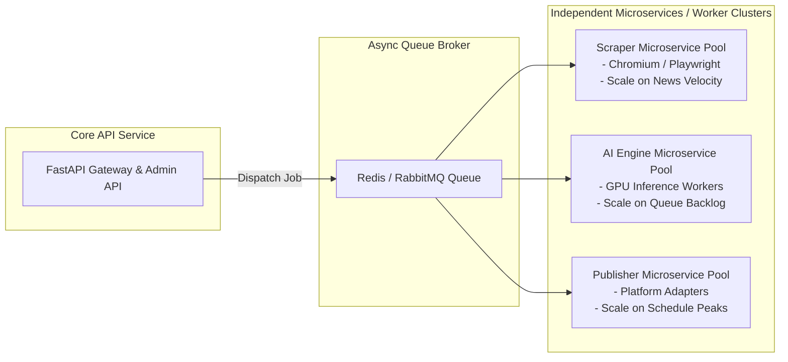
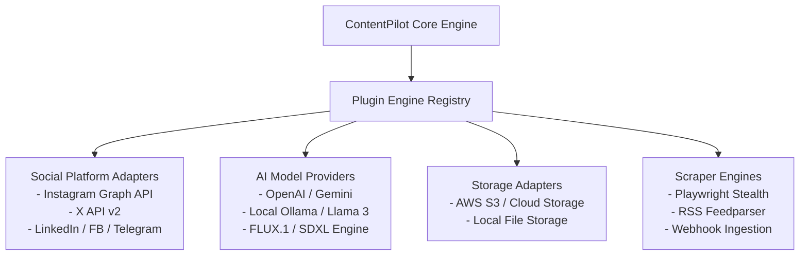
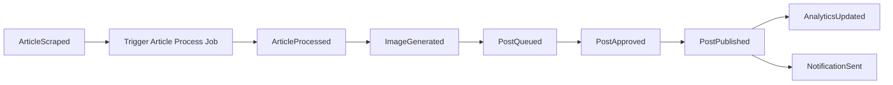

# ContentPilot AI - System Architecture Specification

## 1. System Overview

**ContentPilot AI** is an enterprise-grade, multi-tenant, AI-powered social media content automation platform. The platform automates the entire content workflow lifecycle:
1. **Aggregating** raw news from RSS feeds, web portals, and media APIs via stealth browser automation and HTTP scrapers.
2. **Normalizing** and storing unstructured article data into PostgreSQL with vector embeddings for semantic deduplication.
3. **Synthesizing** original editorial content using Large Language Models (LLMs) and Multimodal Vision models.
4. **Transforming** copyright-restricted source images into original, branded editorial art via Vision-driven Prompt Engineering and FLUX/Stable Diffusion generative models.
5. **Managing** multi-stage human approval workflows, workspace RBAC, and timezone-aware content queues.
6. **Publishing** posts automatically to social platforms (Instagram, X, LinkedIn, Facebook, Threads, Telegram) via modular platform adapters.
7. **Collecting** performance analytics to optimize future AI generation parameters.

---

## 2. High-Level System Architecture (C4 Model)

### Container Architecture Diagram

```mermaid
graph TB
    subgraph Client Layer
        WebClient["Next.js 14 Frontend<br/>(TypeScript / React / Tailwind / Shadcn)"]
        MobileClient["Mobile Web / PWA Client"]
    end

    subgraph API Gateway & Edge Layer
        CDN["Cloudflare CDN & WAF"]
        NginxGateway["Nginx / Traefik Reverse Proxy<br/>(SSL Termination & Rate Limiting)"]
    end

    subgraph Application Core (FastAPI Backend)
        APIServer["FastAPI REST Server<br/>(Python 3.12 / Async / Clean Arch)"]
        AuthService["JWT & RBAC Module"]
        DomainLayer["Domain Use Cases & Service Layer"]
    end

    subgraph Asynchronous Worker Layer (Celery Ecosystem)
        ScraperWorker["Scraper Workers<br/>(Playwright / HTTPX)"]
        AIPipelineWorker["AI Pipeline Workers<br/>(LLM / Vision / FLUX / SDXL)"]
        PublisherWorker["Publisher Workers<br/>(Platform Adapters / Playwright)"]
        CeleryBeat["Celery Beat Scheduler<br/>(Periodic News & Post Triggering)"]
    end

    subgraph Data & Storage Layer
        PostgreSQL[("PostgreSQL 16 + pgvector<br/>(Primary DB)")]
        RedisStore[("Redis 7<br/>(Cache, Rate Limiting, Celery Broker)")]
        S3Storage[("S3 / Object Storage<br/>(Branded Images, Source Media)")]
    end

    subgraph External Provider Layer
        AIProviders["AI Model Gateway<br/>(OpenAI / Gemini / Anthropic / Local Ollama)"]
        SocialPlatforms["Social Media APIs<br/>(Instagram Graph API, X API v2, LinkedIn, FB)"]
        NewsSources["External News Portals & RSS Feeds"]
    end

    %% Flow Connections
    WebClient -->|HTTPS / WSS| CDN
    MobileClient -->|HTTPS| CDN
    CDN --> NginxGateway
    NginxGateway --> APIServer

    APIServer --> AuthService
    APIServer --> DomainLayer
    APIServer --> PostgreSQL
    APIServer --> RedisStore

    DomainLayer -->|Enqueue Tasks| RedisStore
    CeleryBeat -->|Trigger Schedule| RedisStore

    RedisStore --> ScraperWorker
    RedisStore --> AIPipelineWorker
    RedisStore --> PublisherWorker

    ScraperWorker -->|Fetch Raw Articles| NewsSources
    ScraperWorker --> PostgreSQL
    ScraperWorker --> S3Storage

    AIPipelineWorker --> AIProviders
    AIPipelineWorker --> PostgreSQL
    AIPipelineWorker --> S3Storage

    PublisherWorker --> SocialPlatforms
    PublisherWorker --> PostgreSQL

    classDef primary fill:#1e293b,stroke:#3b82f6,stroke-width:2px,color:#fff;
    classDef worker fill:#0f172a,stroke:#10b981,stroke-width:2px,color:#fff;
    classDef storage fill:#1e1b4b,stroke:#8b5cf6,stroke-width:2px,color:#fff;
    class Def External fill:#2a1215,stroke:#ef4444,stroke-width:2px,color:#fff;

    class WebClient,MobileClient,APIServer,DomainLayer primary;
    class ScraperWorker,AIPipelineWorker,PublisherWorker,CeleryBeat worker;
    class PostgreSQL,RedisStore,S3Storage storage;
    class AIProviders,SocialPlatforms,NewsSources External;
```

---

## 3. Clean Architecture & Layering Strategy

The application enforces strict separation of concerns following **Clean Architecture** and **Domain-Driven Design (DDD)** principles.

```
       +--------------------------------------------------+
       |             Frameworks & Drivers                 |
       |  (FastAPI, SQLAlchemy, Celery, Playwright, React) |
       |  +--------------------------------------------+  |
       |  |          Interface Adapters                |  |
       |  |  (REST Controllers, Repositories, DTOs)    |  |
       |  |  +--------------------------------------+  |  |
       |  |  |          Application / Use Cases     |  |  |
       |  |  |  (ScrapeArticleUC, PublishPostUC)    |  |  |
       |  |  |  +--------------------------------+  |  |  |
       |  |  |  |        Domain Entities         |  |  |  |
       |  |  |  |  (Article, Post, Workspace)    |  |  |  |
       |  |  |  +--------------------------------+  |  |  |
       |  |  +--------------------------------------+  |  |
       |  +--------------------------------------------+  |
       +--------------------------------------------------+
```

### Layer Responsibilities

1. **Domain Layer (`app/domain/`)**:
   - Contains pure business logic, domain models, value objects, domain events, and domain validation rules.
   - **Zero dependencies** on frameworks, database libraries, ORMs, or third-party APIs.
2. **Application / Use Case Layer (`app/use_cases/`)**:
   - Implements specific business workflows (e.g., `GeneratePostFromArticleUseCase`, `ApproveContentQueueUseCase`).
   - Declares interface contracts (Abstract Base Classes) for repositories and external adapters.
3. **Interface Adapters Layer (`app/adapters/` & `app/infrastructure/`)**:
   - **Repositories**: Implements data persistence contracts using SQLAlchemy 2.0 Async ORM.
   - **External Adapters**: Implements integrations for AI providers (OpenAI, Gemini, Local models) and Social Media APIs (Instagram Graph API, X API v2).
   - **Controllers & DTOs**: FastAPI routers, request validation schemas (Pydantic v2), and response serializers.
4. **Frameworks & Drivers Layer**:
   - Infrastructure configurations (PostgreSQL engine, Redis connection pool, Docker environment, Celery tasks).

---

## 4. Repository & Service Pattern Architecture

### 4.1 Repository Interface Pattern Example (`app/domain/interfaces/repositories.py`)

```python
from abc import ABC, abstractmethod
from typing import Sequence, Optional
from uuid import UUID
from app.domain.entities.article import Article

class ArticleRepositoryInterface(ABC):
    """Abstract contract enforcing repository isolation from persistence implementations."""
    
    @abstractmethod
    async def get_by_id(self, article_id: UUID) -> Optional[Article]:
        pass

    @abstractmethod
    async def get_by_url_hash(self, url_hash: str) -> Optional[Article]:
        pass

    @abstractmethod
    async def get_pending_ai_processing(self, limit: int = 50) -> Sequence[Article]:
        pass

    @abstractmethod
    async def save(self, article: Article) -> Article:
        pass

    @abstractmethod
    async def update_status(self, article_id: UUID, status: str) -> bool:
        pass
```

### 4.2 SQLAlchemy Repository Implementation (`app/infrastructure/repositories/article_repository.py`)

```python
from typing import Sequence, Optional
from uuid import UUID
from sqlalchemy import select, update
from sqlalchemy.ext.asyncio import AsyncSession

from app.domain.entities.article import Article as ArticleEntity
from app.domain.interfaces.repositories import ArticleRepositoryInterface
from app.infrastructure.database.models import ArticleModel

class ArticleRepository(ArticleRepositoryInterface):
    """SQLAlchemy 2.0 Async implementation of ArticleRepositoryInterface."""
    
    def __init__(self, session: AsyncSession) -> None:
        self._session = session

    async def get_by_id(self, article_id: UUID) -> Optional[ArticleEntity]:
        stmt = select(ArticleModel).where(ArticleModel.id == article_id)
        result = await self._session.execute(stmt)
        model = result.scalar_one_or_none()
        return model.to_entity() if model else None

    async def get_by_url_hash(self, url_hash: str) -> Optional[ArticleEntity]:
        stmt = select(ArticleModel).where(ArticleModel.url_hash == url_hash)
        result = await self._session.execute(stmt)
        model = result.scalar_one_or_none()
        return model.to_entity() if model else None

    async def get_pending_ai_processing(self, limit: int = 50) -> Sequence[ArticleEntity]:
        stmt = (
            select(ArticleModel)
            .where(ArticleModel.status == "PENDING_AI")
            .order_by(ArticleModel.scraped_at.desc())
            .limit(limit)
        )
        result = await self._session.execute(stmt)
        return [model.to_entity() for model in result.scalars().all()]

    async def save(self, article: ArticleEntity) -> ArticleEntity:
        model = ArticleModel.from_entity(article)
        self._session.add(model)
        await self._session.flush()
        return model.to_entity()

    async def update_status(self, article_id: UUID, status: str) -> bool:
        stmt = (
            update(ArticleModel)
            .where(ArticleModel.id == article_id)
            .values(status=status)
        )
        result = await self._session.execute(stmt)
        return result.rowcount > 0
```

### 4.3 Service Layer with Dependency Injection (`app/services/ai_pipeline_service.py`)

```python
from uuid import UUID
from app.domain.interfaces.repositories import ArticleRepositoryInterface, GeneratedPostRepositoryInterface
from app.domain.interfaces.ai_provider import AIProviderInterface
from app.domain.entities.post import GeneratedPost

class AIPipelineService:
    """Domain service orchestrating multi-step AI synthesis."""
    
    def __init__(
        self,
        article_repo: ArticleRepositoryInterface,
        post_repo: GeneratedPostRepositoryInterface,
        ai_provider: AIProviderInterface,
    ) -> None:
        self.article_repo = article_repo
        self.post_repo = post_repo
        self.ai_provider = ai_provider

    async def process_article_to_post(self, article_id: UUID, workspace_id: UUID, brand_tone: str) -> GeneratedPost:
        article = await self.article_repo.get_by_id(article_id)
        if not article:
            raise ValueError(f"Article {article_id} not found")

        # Step 1: Summarize Article
        summary = await self.ai_provider.summarize_text(article.content)

        # Step 2: Generate Platform Caption & Hashtags
        caption_data = await self.ai_provider.generate_social_caption(
            summary=summary,
            tone=brand_tone,
            category=article.category,
        )

        # Step 3: Vision Analysis on Source Image & Generative Prompt Crafting
        scene_description = await self.ai_provider.analyze_image_vision(article.top_image_url)
        image_prompt = await self.ai_provider.build_editorial_image_prompt(
            scene_description=scene_description,
            article_summary=summary,
        )

        # Step 4: Synthesize Editorial Image
        generated_image_url = await self.ai_provider.generate_editorial_image(image_prompt)

        # Step 5: Construct Post Domain Model
        post = GeneratedPost.create(
            workspace_id=workspace_id,
            article_id=article_id,
            caption=caption_data["caption"],
            hashtags=caption_data["hashtags"],
            image_url=generated_image_url,
            image_prompt=image_prompt,
        )

        saved_post = await self.post_repo.save(post)
        await self.article_repo.update_status(article_id, "PROCESSED")
        return saved_post
```

---

## 5. Modular Repository Folder Structure

```
ContentPilot/
├── backend/
│   ├── app/
│   │   ├── api/                    # REST API Endpoint Controllers & Routers
│   │   │   ├── v1/
│   │   │   │   ├── endpoints/
│   │   │   │   │   ├── auth.py
│   │   │   │   │   ├── users.py
│   │   │   │   │   ├── workspaces.py
│   │   │   │   │   ├── news_sources.py
│   │   │   │   │   ├── articles.py
│   │   │   │   │   ├── ai.py
│   │   │   │   │   ├── queue.py
│   │   │   │   │   ├── schedules.py
│   │   │   │   │   ├── publishing.py
│   │   │   │   │   ├── analytics.py
│   │   │   │   │   └── settings.py
│   │   │   │   └── dependencies.py  # FastAPI DI providers
│   │   │   └── router.py
│   │   ├── core/                   # Security, Configs, Logging & Exceptions
│   │   │   ├── config.py
│   │   │   ├── security.py
│   │   │   ├── logging.py
│   │   │   ├── exceptions.py
│   │   │   └── database.py
│   │   ├── domain/                 # Core Domain Entities & Interface Contracts
│   │   │   ├── entities/
│   │   │   │   ├── user.py
│   │   │   │   ├── workspace.py
│   │   │   │   ├── news_source.py
│   │   │   │   ├── article.py
│   │   │   │   ├── post.py
│   │   │   │   └── analytics.py
│   │   │   └── interfaces/
│   │   │       ├── repositories.py
│   │   │       ├── ai_provider.py
│   │   │       └── social_platform.py
│   │   ├── use_cases/              # Business Orchestration Workflows
│   │   │   ├── scrape_news_use_case.py
│   │   │   ├── process_ai_content_use_case.py
│   │   │   ├── approve_post_use_case.py
│   │   │   └── publish_post_use_case.py
│   │   ├── services/               # Shared Domain Services
│   │   │   ├── ai_pipeline_service.py
│   │   │   ├── branding_service.py
│   │   │   └── publisher_service.py
│   │   ├── infrastructure/         # External Concrete Implementations
│   │   │   ├── database/           # SQLAlchemy Async Engine & Models
│   │   │   │   ├── base.py
│   │   │   │   ├── models.py
│   │   │   │   └── alembic/
│   │   │   ├── repositories/       # SQLAlchemy Repository Implementations
│   │   │   ├── external/
│   │   │   │   ├── ai/             # OpenAI, Gemini, SDXL, Local Ollama Adapters
│   │   │   │   └── social/         # Instagram, X, LinkedIn, FB Adapters
│   │   │   └── storage/            # AWS S3 / Local Object Storage Adapters
│   │   └── workers/                # Celery Async Task Handlers & Beat Schedulers
│   │       ├── celery_app.py
│   │       ├── tasks_scraper.py
│   │       ├── tasks_ai.py
│   │       └── tasks_publisher.py
│   ├── tests/
│   ├── Dockerfile
│   ├── docker-compose.yml
│   └── requirements.txt
├── frontend/
│   ├── src/
│   │   ├── app/                    # Next.js 14 App Router Pages
│   │   │   ├── (auth)/
│   │   │   ├── (dashboard)/
│   │   │   │   ├── overview/
│   │   │   │   ├── news-feed/
│   │   │   │   ├── queue/
│   │   │   │   ├── schedules/
│   │   │   │   ├── analytics/
│   │   │   │   └── settings/
│   │   │   ├── layout.tsx
│   │   │   └── page.tsx
│   │   ├── components/             # UI Components (Shadcn + Custom)
│   │   │   ├── ui/                 # Atomic Primitive Components
│   │   │   ├── dashboard/          # Feature Specific Components
│   │   │   ├── ai-studio/
│   │   │   └── queue/
│   │   ├── core/                   # API Axios Client, Interceptors
│   │   ├── hooks/                  # TanStack Query & Custom Hooks
│   │   ├── store/                  # Zustand Global State Slices
│   │   ├── types/                  # TypeScript Data Contracts
│   │   └── lib/                    # Utilities, Formats, Validators
│   ├── public/
│   ├── package.json
│   └── tailwind.config.js
└── docs/                           # System Documentation
```

---

## 6. Monolith-to-Microservices Scalability Strategy

To ensure seamless horizontal scaling as platform user volume expands, the architecture is decoupled from day one using an **Event-Driven Modular Monolith** approach.



### Microservice Migration Milestones

1. **Phase 1 (Modular Monolith)**:
   - Single repository with clean boundary separation (`app/domain`, `app/use_cases`).
   - Asynchronous background execution via Redis + Celery.
   - Shared PostgreSQL database instance.
2. **Phase 2 (Worker Isolation)**:
   - Separate container deployment for `api-server`, `scraper-worker`, `ai-worker`, and `publisher-worker`.
   - Resource allocation customization (e.g., attach GPU instances specifically to `ai-worker` nodes).
3. **Phase 3 (Full Microservice Decoupling)**:
   - **Scraper Microservice**: Exposes gRPC endpoints for on-demand crawling; publishes `ArticleIngestedEvent` to Kafka/RabbitMQ.
   - **AI Microservice**: Independent service handling model inference, vision prompts, and image generation, maintaining dedicated model caching pools.
   - **Publisher Microservice**: Independent service handling OAuth token renewal, platform-specific rate limits, and post delivery.

---

## 7. Enterprise Plugin Architecture

ContentPilot AI enforces a zero-core-modification plugin architecture. New social networks, AI providers, storage backends, and news scrapers register as pluggable adapters via abstract interface factories (`app/domain/interfaces/`).



---

## 8. Domain Events Architecture

The core domain emits strongly typed events (`app/domain/events.py`) consumed asynchronously by background task handlers and notification dispatchers:



### Domain Event Definitions:
1. `ArticleScrapedEvent`: Published when a news scraper normalizes a new article.
2. `ArticleProcessedEvent`: Emitted after LLM summarization and category tagging.
3. `ImageGeneratedEvent`: Emitted when generative diffusion artwork is saved to S3.
4. `PostQueuedEvent`: Emitted when a generated post enters `PENDING_APPROVAL`.
5. `PostApprovedEvent`: Emitted when a user approves a post for scheduling.
6. `PostPublishedEvent`: Emitted after successful social network dispatch.
7. `AnalyticsUpdatedEvent`: Emitted when social engagement metrics are refreshed.
8. `NotificationSentEvent`: Emitted when multi-channel alerts are dispatched.

