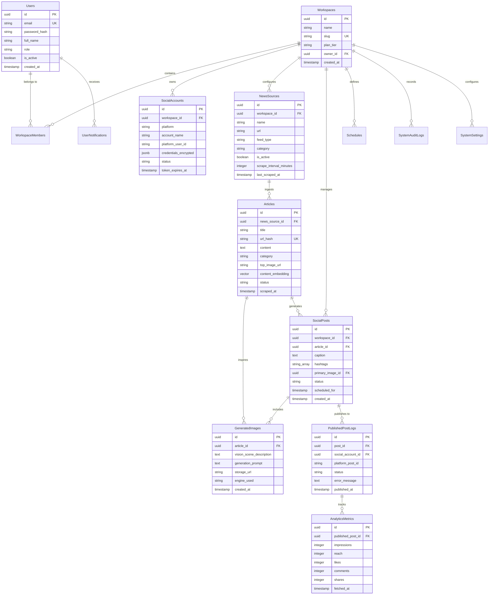

# ContentPilot AI - Database Architecture & Schema Specification

## 1. Overview

ContentPilot AI uses **PostgreSQL 16** enhanced with the **pgvector** extension for vector similarity search (semantic deduplication) and **B-tree/GIN/GiST** indexing for high-performance querying across multi-tenant workspaces.

### Core Database Capabilities:
- **Multi-Tenant Isolation**: Row-Level Security (RLS) and strict `workspace_id` foreign key enforcement.
- **Semantic Vector Storage**: 1536-dimensional embeddings (`vector(1536)`) for news articles to detect duplicate stories across distinct RSS feeds.
- **Auditability**: Automated `created_at` and `updated_at` triggers on every table.
- **JSONB Flexibility**: Metadata, OAuth tokens, and analytics pay-loads stored as structured JSONB with GIN indexes.

---

## 2. Entity Relationship Diagram (ERD)



---

## 3. Detailed Table Schema Definitions

### 3.1 `users`
Stores user identities, credentials, and global system roles.

| Column | Type | Constraints | Description |
| :--- | :--- | :--- | :--- |
| `id` | `UUID` | `PRIMARY KEY`, Default `gen_random_uuid()` | Unique user ID |
| `email` | `VARCHAR(255)` | `UNIQUE`, `NOT NULL` | User email address |
| `password_hash` | `VARCHAR(255)` | `NOT NULL` | Argon2 / Bcrypt hashed password |
| `full_name` | `VARCHAR(100)` | `NOT NULL` | User display name |
| `role` | `VARCHAR(20)` | `NOT NULL`, Default `'MEMBER'` | Global Role (`SUPER_ADMIN`, `USER`) |
| `is_active` | `BOOLEAN` | `NOT NULL`, Default `TRUE` | Account status flag |
| `is_mfa_enabled` | `BOOLEAN` | `NOT NULL`, Default `FALSE` | Multi-Factor Authentication state |
| `mfa_secret` | `VARCHAR(128)` | `NULL` | Encrypted TOTP secret |
| `created_at` | `TIMESTAMPTZ` | `NOT NULL`, Default `NOW()` | Creation timestamp |
| `updated_at` | `TIMESTAMPTZ` | `NOT NULL`, Default `NOW()` | Modification timestamp |

- **Indexes**:
  - `idx_users_email` UNIQUE (`email`)

---

### 3.2 `workspaces`
Multi-tenant workspace isolation unit.

| Column | Type | Constraints | Description |
| :--- | :--- | :--- | :--- |
| `id` | `UUID` | `PRIMARY KEY`, Default `gen_random_uuid()` | Workspace ID |
| `name` | `VARCHAR(100)` | `NOT NULL` | Organization / Workspace Name |
| `slug` | `VARCHAR(100)` | `UNIQUE`, `NOT NULL` | URL slug |
| `owner_id` | `UUID` | `FOREIGN KEY (users.id)`, `NOT NULL` | Creator/Owner ID |
| `plan_tier` | `VARCHAR(20)` | `NOT NULL`, Default `'STARTER'` | SaaS Tier (`STARTER`, `PRO`, `ENTERPRISE`) |
| `settings` | `JSONB` | `NOT NULL`, Default `'{}'` | Custom branding, timezone & default LLM settings |
| `created_at` | `TIMESTAMPTZ` | `NOT NULL`, Default `NOW()` | Creation timestamp |

- **Indexes**:
  - `idx_workspaces_slug` UNIQUE (`slug`)
  - `idx_workspaces_owner` (`owner_id`)

---

### 3.3 `workspace_members`
Junction table managing Role-Based Access Control (RBAC) per workspace.

| Column | Type | Constraints | Description |
| :--- | :--- | :--- | :--- |
| `id` | `UUID` | `PRIMARY KEY`, Default `gen_random_uuid()` | Record ID |
| `workspace_id` | `UUID` | `FOREIGN KEY (workspaces.id) ON DELETE CASCADE` | Workspace ID |
| `user_id` | `UUID` | `FOREIGN KEY (users.id) ON DELETE CASCADE` | User ID |
| `role` | `VARCHAR(20)` | `NOT NULL`, Default `'EDITOR'` | Workspace Role (`OWNER`, `ADMIN`, `EDITOR`, `VIEWER`) |
| `created_at` | `TIMESTAMPTZ` | `NOT NULL`, Default `NOW()` | Creation timestamp |

- **Indexes**:
  - `idx_wm_workspace_user` UNIQUE (`workspace_id`, `user_id`)

---

### 3.4 `social_accounts`
Stores connected social media platform credentials and OAuth refresh tokens.

| Column | Type | Constraints | Description |
| :--- | :--- | :--- | :--- |
| `id` | `UUID` | `PRIMARY KEY`, Default `gen_random_uuid()` | Account ID |
| `workspace_id` | `UUID` | `FOREIGN KEY (workspaces.id) ON DELETE CASCADE` | Workspace ID |
| `platform` | `VARCHAR(30)` | `NOT NULL` | Platform (`INSTAGRAM`, `X`, `LINKEDIN`, `FACEBOOK`, `THREADS`, `TELEGRAM`) |
| `account_name` | `VARCHAR(100)` | `NOT NULL` | Social handle / account label |
| `platform_user_id` | `VARCHAR(100)` | `NOT NULL` | Platform internal user ID |
| `encrypted_tokens` | `JSONB` | `NOT NULL` | AES-256 encrypted access & refresh tokens |
| `status` | `VARCHAR(20)` | `NOT NULL`, Default `'CONNECTED'` | Status (`CONNECTED`, `EXPIRED`, `DISCONNECTED`) |
| `token_expires_at` | `TIMESTAMPTZ` | `NULL` | Access token expiration timestamp |
| `created_at` | `TIMESTAMPTZ` | `NOT NULL`, Default `NOW()` | Connection timestamp |

- **Indexes**:
  - `idx_social_workspace_platform` (`workspace_id`, `platform`)

---

### 3.5 `news_sources`
Configured news feeds and scrapers.

| Column | Type | Constraints | Description |
| :--- | :--- | :--- | :--- |
| `id` | `UUID` | `PRIMARY KEY`, Default `gen_random_uuid()` | Source ID |
| `workspace_id` | `UUID` | `FOREIGN KEY (workspaces.id) ON DELETE CASCADE` | Workspace ID |
| `name` | `VARCHAR(100)` | `NOT NULL` | Source display name |
| `url` | `TEXT` | `NOT NULL` | Feed URL or target Portal URL |
| `feed_type` | `VARCHAR(20)` | `NOT NULL` | Type (`RSS`, `HTML_PLAYWRIGHT`, `REST_API`) |
| `category` | `VARCHAR(50)` | `NOT NULL` | Content category (`Technology`, `Business`, `Space`, etc.) |
| `is_active` | `BOOLEAN` | `NOT NULL`, Default `TRUE` | Enable/Disable Scraping |
| `scrape_interval_minutes` | `INT` | `NOT NULL`, Default `15` | Polling frequency |
| `last_scraped_at` | `TIMESTAMPTZ` | `NULL` | Timestamp of last execution |

- **Indexes**:
  - `idx_news_sources_workspace` (`workspace_id`)
  - `idx_news_sources_active_scrape` (`is_active`, `last_scraped_at`)

---

### 3.6 `articles`
Normalized raw articles extracted from scrapers.

| Column | Type | Constraints | Description |
| :--- | :--- | :--- | :--- |
| `id` | `UUID` | `PRIMARY KEY`, Default `gen_random_uuid()` | Article ID |
| `news_source_id` | `UUID` | `FOREIGN KEY (news_sources.id) ON DELETE CASCADE` | Source ID |
| `title` | `TEXT` | `NOT NULL` | Article headline |
| `url` | `TEXT` | `NOT NULL` | Source article URL |
| `url_hash` | `VARCHAR(64)` | `UNIQUE`, `NOT NULL` | SHA-256 hash of URL for deduplication |
| `content` | `TEXT` | `NOT NULL` | Cleaned plain-text content |
| `top_image_url` | `TEXT` | `NULL` | Source image URL extracted from news article |
| `category` | `VARCHAR(50)` | `NOT NULL` | Derived/assigned category |
| `content_embedding` | `vector(1536)` | `NULL` | Open AI text-embedding-3-small vector |
| `status` | `VARCHAR(20)` | `NOT NULL`, Default `'PENDING_AI'` | (`PENDING_AI`, `PROCESSED`, `DUPLICATE`, `FAILED`) |
| `scraped_at` | `TIMESTAMPTZ` | `NOT NULL`, Default `NOW()` | Ingestion timestamp |

- **Indexes**:
  - `idx_articles_url_hash` UNIQUE (`url_hash`)
  - `idx_articles_status_scraped` (`status`, `scraped_at`)
  - `idx_articles_vector` HNSW (`content_embedding` vector_cosine_ops)

---

### 3.7 `generated_images`
AI Synthesized editorial artwork metadata.

| Column | Type | Constraints | Description |
| :--- | :--- | :--- | :--- |
| `id` | `UUID` | `PRIMARY KEY`, Default `gen_random_uuid()` | Image ID |
| `article_id` | `UUID` | `FOREIGN KEY (articles.id) ON DELETE CASCADE` | Source Article ID |
| `vision_scene_description` | `TEXT` | `NOT NULL` | Multimodal Vision model scene breakdown |
| `generation_prompt` | `TEXT` | `NOT NULL` | Final synthesized SDXL / FLUX prompt |
| `storage_path` | `TEXT` | `NOT NULL` | S3 Object Key / URL |
| `engine_used` | `VARCHAR(50)` | `NOT NULL` | Engine (`FLUX_1_DEV`, `STABLE_DIFFUSION_XL`, `DALL_E_3`) |
| `aspect_ratio` | `VARCHAR(10)` | `NOT NULL`, Default `'1:1'` | Image Ratio (`1:1`, `4:5`, `9:16`) |
| `has_watermark_branding` | `BOOLEAN` | `NOT NULL`, Default `TRUE` | Branding overlay flag |
| `created_at` | `TIMESTAMPTZ` | `NOT NULL`, Default `NOW()` | Synthesis timestamp |

---

### 3.8 `social_posts`
Content post queue items ready for approval, scheduling, or publishing.

| Column | Type | Constraints | Description |
| :--- | :--- | :--- | :--- |
| `id` | `UUID` | `PRIMARY KEY`, Default `gen_random_uuid()` | Post ID |
| `workspace_id` | `UUID` | `FOREIGN KEY (workspaces.id) ON DELETE CASCADE` | Workspace ID |
| `article_id` | `UUID` | `FOREIGN KEY (articles.id) ON DELETE SET NULL` | Reference Article |
| `primary_image_id` | `UUID` | `FOREIGN KEY (generated_images.id) ON DELETE SET NULL` | Attached Artwork |
| `caption` | `TEXT` | `NOT NULL` | AI-generated caption text |
| `hashtags` | `VARCHAR(50)[]` | `NOT NULL` | Hashtag array |
| `target_platforms` | `VARCHAR(30)[]` | `NOT NULL` | Array of platforms target (`["INSTAGRAM"]`) |
| `status` | `VARCHAR(20)` | `NOT NULL`, Default `'DRAFT'` | (`DRAFT`, `PENDING_APPROVAL`, `APPROVED`, `SCHEDULED`, `PUBLISHED`, `FAILED`) |
| `scheduled_for` | `TIMESTAMPTZ` | `NULL` | Scheduled execution time |
| `approved_by_user_id` | `UUID` | `FOREIGN KEY (users.id)` | Approver User ID |
| `created_at` | `TIMESTAMPTZ` | `NOT NULL`, Default `NOW()` | Creation timestamp |

- **Indexes**:
  - `idx_social_posts_workspace_status` (`workspace_id`, `status`)
  - `idx_social_posts_scheduled` (`status`, `scheduled_for`)

---

### 3.9 `published_post_logs`
Execution log and platform-assigned post IDs for tracking published social posts.

| Column | Type | Constraints | Description |
| :--- | :--- | :--- | :--- |
| `id` | `UUID` | `PRIMARY KEY`, Default `gen_random_uuid()` | Log ID |
| `post_id` | `UUID` | `FOREIGN KEY (social_posts.id) ON DELETE CASCADE` | Core Post ID |
| `social_account_id` | `UUID` | `FOREIGN KEY (social_accounts.id) ON DELETE CASCADE` | Target Account |
| `platform` | `VARCHAR(30)` | `NOT NULL` | Social Platform |
| `platform_post_id` | `VARCHAR(100)` | `NULL` | Social platform's native post ID / URL |
| `status` | `VARCHAR(20)` | `NOT NULL` | (`SUCCESS`, `FAILED`, `RETRIED`) |
| `error_details` | `JSONB` | `NULL` | Error code & raw response payload on failure |
| `published_at` | `TIMESTAMPTZ` | `NOT NULL`, Default `NOW()` | Publication timestamp |

- **Indexes**:
  - `idx_published_logs_post` (`post_id`)
  - `idx_published_logs_account_date` (`social_account_id`, `published_at`)

---

### 3.10 `analytics_metrics` (Partitioned Table Strategy)
High-volume engagement metric storage partitioned by range (`published_at`).

| Column | Type | Constraints | Description |
| :--- | :--- | :--- | :--- |
| `id` | `UUID` | `NOT NULL` | Metric Record ID |
| `published_post_log_id` | `UUID` | `NOT NULL` | Published Post Reference |
| `impressions` | `INT` | `NOT NULL`, Default `0` | Total views |
| `reach` | `INT` | `NOT NULL`, Default `0` | Unique viewers |
| `likes` | `INT` | `NOT NULL`, Default `0` | Like count |
| `comments` | `INT` | `NOT NULL`, Default `0` | Comment count |
| `shares` | `INT` | `NOT NULL`, Default `0` | Share / Repost count |
| `clicks` | `INT` | `NOT NULL`, Default `0` | Link clicks |
| `fetched_at` | `TIMESTAMPTZ` | `NOT NULL`, Default `NOW()` | Metric collection timestamp |

---

## 4. Partitioning & Indexing Strategy

### Monthly Range Partitioning on `analytics_metrics`
To support millions of analytics snapshots without degrading database performance:

```sql
CREATE TABLE analytics_metrics (
    id UUID NOT NULL DEFAULT gen_random_uuid(),
    published_post_log_id UUID NOT NULL,
    impressions INT NOT NULL DEFAULT 0,
    reach INT NOT NULL DEFAULT 0,
    likes INT NOT NULL DEFAULT 0,
    comments INT NOT NULL DEFAULT 0,
    shares INT NOT NULL DEFAULT 0,
    clicks INT NOT NULL DEFAULT 0,
    fetched_at TIMESTAMPTZ NOT NULL DEFAULT NOW(),
    PRIMARY KEY (id, fetched_at)
) PARTITION BY RANGE (fetched_at);

-- Initial Monthly Partitions
CREATE TABLE analytics_metrics_2026_07 PARTITION OF analytics_metrics
    FOR VALUES FROM ('2026-07-01 00:00:00+00') TO ('2026-08-01 00:00:00+00');

CREATE TABLE analytics_metrics_2026_08 PARTITION OF analytics_metrics
    FOR VALUES FROM ('2026-08-01 00:00:00+00') TO ('2026-09-01 00:00:00+00');
```

---

## 5. Future Extensibility Tables (Phase 2 & 3 Schema Additions)

1. **`brand_templates`**: Stores SVG overlay configurations, custom fonts, logo placements, and color schemes for automatic image watermarking.
2. **`ab_test_experiments`**: Tracks multi-variant caption and image generation for automated performance ranking optimization.
3. **`user_api_keys`**: For SaaS API tier customers to trigger content generation directly via webhook integrations.

---

## 6. Audit Logging System (`system_audit_logs`)

To comply with enterprise SaaS security standards and track administrative events (Approvals, Rejects, Schedule Changes, Prompt Changes, Logins, Workspace Settings modifications, API Usage), all audit actions are appended to `system_audit_logs`.

### `system_audit_logs` Schema Definition

| Column | Type | Constraints | Description |
| :--- | :--- | :--- | :--- |
| `id` | `UUID` | `PRIMARY KEY`, Default `gen_random_uuid()` | Audit Record ID |
| `workspace_id` | `UUID` | `FOREIGN KEY (workspaces.id) ON DELETE CASCADE` | Associated Workspace ID |
| `actor_id` | `UUID` | `FOREIGN KEY (users.id) ON DELETE SET NULL` | Performing User ID (or NULL for System Worker) |
| `event_type` | `VARCHAR(50)` | `NOT NULL` | Event type (`POST_APPROVED`, `POST_REJECTED`, `SCHEDULE_CHANGED`, `PROMPT_UPDATED`, `USER_LOGIN`, `WORKSPACE_CHANGED`, `API_REQUEST`) |
| `resource_type` | `VARCHAR(30)` | `NOT NULL` | Resource category (`SocialPost`, `Workspace`, `User`, `NewsSource`) |
| `resource_id` | `UUID` | `NULL` | ID of target entity |
| `ip_address` | `VARCHAR(45)` | `NULL` | Client IPv4 / IPv6 address |
| `payload_before` | `JSONB` | `NULL` | Entity JSON state prior to modification |
| `payload_after` | `JSONB` | `NULL` | Entity JSON state post modification |
| `created_at` | `TIMESTAMPTZ` | `NOT NULL`, Default `NOW()` | Audit event timestamp |

- **Indexes**:
  - `idx_audit_logs_workspace_type` (`workspace_id`, `event_type`)
  - `idx_audit_logs_actor_date` (`actor_id`, `created_at`)
  - `idx_audit_logs_created_at` (`created_at`)

